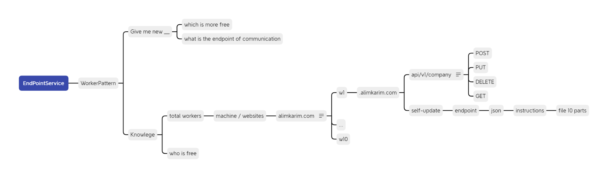

# 01 — Overview: Main / Worker Service Architecture

> **/goal** Master and enforce the architectural standards, specifications, and CI/CD validation rules for 19 Main Worker Service.
> **/learn** Read the sequentially ordered specification files in this directory, follow the actionable CI/CD checklist, and apply mandatory rules before generating code.

## 🎯 Actionable CI/CD & Agent Checklist

- [ ] `/goal` Read and understand all numbered specifications under `19-main-worker-service/`.
- [ ] `/learn` Adhere strictly to `.ai-memory/folder-structure.md` and `.ai-memory/strictly-avoid.md`.
- [ ] `/goal` Verify zero explicit `true` boolean evaluations and no mixed-polarity conditionals.
- [ ] `/learn` Run all local verification linters via `python 03-ai-scripts/06-cicd-local-runner.py`.

. **CRITICAL AI INSTRUCTION:** This `01-index.md` file is the primary entry point for this directory. AI agents MUST read this file first before exploring other files in this folder.

**Spec:** `19-main-worker-service`
**Version:** 1.1.0
**Updated:** 2026-05-06
**Default stack:** Laravel (PHP) — stack-agnostic by design.

---

## 0. Mental Model — Kubernetes-style Control Plane

Treat this topology as a **lightweight Kubernetes analogy**:

| Kubernetes concept | This spec's analogue |
|---|---|
| Control plane (api-server + scheduler) | **Main Server** — catalog, routing, admission, push-update fan-out |
| Worker node (kubelet) | **Worker Server** — runs all business logic under its own split-DB |
| Pod scheduling | Tenant→Worker assignment via `05-worker-routing.md` |
| Node heartbeat / `kubelet → api-server` | Worker `POST /Heartbeat` to Main |
| `kubectl apply` / push deploy | Power-Admin push-update (`17-update-channels.md` §2) |
| Reconciliation loop / desired state | Worker pull-update poll loop (`17-update-channels.md` §3) |
| Image registry pull | Worker fetching release zip from a known URL (`17-update-channels.md` §4) |

Three update channels exist (full spec in `17-update-channels.md`):

1. **Pull from Main (Kubernetes-style reconciliation)** — Worker periodically polls `GET /API/V1/SelfUpdate/Desired` on Main; if the desired version differs from its running version, Worker self-updates from a Main-issued URL. Always available.
2. **Pull from a known release URL** — Worker reads its `UpdateSourceUrl` (Seedable-Config) and fetches the latest release JSON+zip directly. Used as Main-independent fallback.
3. **Push from Main (dev/debug only)** — Power Admin uploads a zip and Main fans it out to Workers. **Disabled in production** (`Env=Production` rejects the endpoint with HTTP 403). Allowed when `Env ∈ {Development, Debug, Staging}`.

The Main↔Worker relationship is **declarative**: Main stores desired state, Workers reconcile toward it. The push channel is an explicit override for dev/staging convenience.

---

## 0.1 Author Mindmaps (source of intent)

The architecture in this folder formalizes these author-drawn mindmaps.
The single best one-page summary is image 04. See [`images/readme.md`](./images/readme.md) for the full index.




---

Define a two-tier server topology where a **Main Server** acts as a coordinator (Kubernetes-master analogy) and one or more **Worker Servers** hold all business logic. The Main serves the UI and the React frontend's edge endpoints; Workers do the heavy lifting under their own split-DB.

This spec is the contract any implementer (AI or human) follows to build the topology. Details live in numbered files `01-`…`09-`. Diagrams live in `diagrams/`.

---

## 2. Scope

| In scope | Out of scope |
|----------|--------------|
| Main↔Worker topology, routing, auth handshake | Split-DB internals (see `02-spec/05-split-db-architecture/`) |
| Tenant→Worker mapping in main DB | Seedable-Config internals (see `02-spec/06-seedable-config-architecture/`) |
| Push-update mechanism (main → worker) | Self-update mechanism (pointer only — see `10-self-update-pointer.md`) |
| Role model + `User has access to {EnumPage}` pattern | Generic error handling (see `02-spec/03-error-manage/`) |
| Core API endpoint surface | Per-endpoint business logic |

---

## 3. Stack Flexibility (READ THIS)

The default reference implementation is **Laravel (PHP)**. Every rule in this spec is written stack-agnostically.

> **Future stacks explicitly supported:** .NET, Go (Golang), Python, Node.js, additional PHP frameworks (e.g., Symfony, raw PHP), WordPress as a host.

Implementer obligations regardless of stack:

1. Implement the same REST API surface (`07-core-api-endpoints.md`).
2. Honor the same auth contract (`06-auth-and-2fa.md`).
3. Use the same main-DB schema (`04-main-db-schema.md`) — column names PascalCase, PKs `{TableName}Id INTEGER AUTOINCREMENT`, no UUIDs.
4. Use the same error contract (`09-error-contract.md`) for main↔worker calls.

If a stack-specific deviation is unavoidable, document it in that stack's `99-consistency-report.md` and link back here.

---

## 4. Tenant Root Model

**Decision:** Company-as-root.

- Top-level entity: `Company`.
- A `Company` has many `User`s.
- Worker assignment is per-`Company`. All users of a company route to the same worker.
- Single-user products are modeled as `1 Company : 1 User` (degenerate case). No schema change.

Rationale: matches the verbatim's worked example (`POST /API/V1/Company`, "company-to-worker mapping"). See `29-plan.md` §Decisions.

---

## 5. Two-Tier Topology (one-paragraph version)

**Main Server** serves the React UI, holds a thin SQLite catalog (workers, tenant→worker map, versions), and routes business requests. It runs **no** business logic. **Worker Servers** are independent deployments of the same backend stack; each owns a split-DB (Root / App / Session per `02-spec/05-split-db-architecture/`) and runs all business logic. Both tiers ship with auth, 2FA, session, sign-up, sign-in, and JWT/cookie support out of the box; only the Main serves UI.

Full diagrams in `diagrams/` and details in `02-architecture.md`.

---

## 6. Document Map

A literal AI MUST read every numbered file 00→24 before scoping work. The map below is exhaustive — no file in this folder is optional reading.

| File | Purpose |
|------|---------|
| `29-plan.md` | Phased task list, decisions, open questions |
| `01-index.md` | This file |
| `02-architecture.md` | Topology, request flow, boundaries |
| `03-glossary.md` | Canonical terms |
| `04-main-db-schema.md` | Main-server SQLite schema (single source of truth for `WorkerNode`, `Company`, `UserDirectory`, audit tables) |
| `05-worker-routing.md` | Selection strategies, caching, failover (no endpoint catalogue — see `06-`) |
| `06-auth-and-2fa.md` | Auth flows, 2FA, JWT/cookie, main↔worker handshake |
| `07-core-api-endpoints.md` | **Single source of truth** for the REST surface (paths, payloads, auth) |
| `08-role-based-dashboards.md` | Roles + `User has access to {EnumPage}` pattern |
| `09-error-contract.md` | **Single source of truth** for the JSON error envelope shape |
| `10-self-update-pointer.md` | Pointer-only doc (no implementation) |
| `11-worker-bootstrap-protocol.md` | Worker first-boot registration + heartbeat (defers WorkerNode schema to `03-`) |
| `12-split-db-tier-reconciliation.md` | Authoritative Main↔spec/05 tier mapping (applied stub) |
| `13-jwt-delivery-contract.md` | JWT issuance, claims, verification, rotation |
| `14-error-codes.md` | Error code catalogue (codes only — envelope owned by `08-`) |
| `15-rbac-and-status-seed.md` | RBAC + status enum seed values |
| `16-tunable-constants.md` | **Single source of truth** for every numeric tunable + cache TTL |
| `17-update-channels.md` | Three update channels: pull-from-main, pull-from-url, dev-only push |
| `18-cascading-roles-and-cache-bin.md` | Role cache bin + cascading roles union |
| `19-backup-nodes.md` | Backup-node registration, propagation, lifecycle |
| `20-incremental-backup-sync.md` | Incremental CDC backup sync (Shape A inline column) |
| `21-backup-encryption-and-keys.md` | Pair-RSA encryption + key rotation |
| `22-backup-endpoints.md` | Backup-tier S2S endpoint catalogue (BE-1..BE-6) |
| `23-backup-apply-logic.md` | Backup apply pipeline (stages, transactions, DLQ) |
| `24-snapshot-storage-and-restore.md` | Snapshot build + restore flow |
| `25-threat-model.md` | Threat-model pointer (no implementation) |
| `26-inherited-rules.md` | Inline blind-AI reference for rules inherited from `02-spec/03-`, `04-`, `05-`, `06-` (Phase 13.3) |
| `96-linter-audit.md` | ⚠ Historical linter snapshot — see banner at top |
| `97-acceptance-criteria.md` | Verbatim acceptance criteria mapping |
| `98-changelog.md` | Spec version history |
| `99-consistency-report.md` | ⚠ Historical consistency snapshot — see banner at top |
| `audit/` | Independent blind-AI readiness audits (latest = `07-…-v2.md`); earlier files marked STALE |
| `diagrams/` | Mermaid ERDs + sequence diagrams (non-authoritative projections) |

---

## 7. Compliance References

> **Blind-AI inline reference (Phase 13.3):** the operative subset of every inherited rule below — enough to implement without leaving this folder — is inlined in **[`26-inherited-rules.md`](./26-inherited-rules.md)**. Read that file first; the source-spec links remain authoritative on conflict.

This spec inherits and does not redefine:

- `.ai-memory/coding-guidelines.md` — function length, zero-nesting, positive booleans, PascalCase, enum-for-Type/Status/Category/Kind
- `02-spec/03-error-manage/` — generic error rules (catch → log → rethrow; `apperror` wrapping; explicit file/op context)
- `02-spec/04-database-conventions/` — DB schema + REST header rules (PascalCase, `{TableName}Id`, no UUIDs as PKs, `X-Correlation-Id` / `X-Idempotency-Key` / `X-Auth-Action`)
- `02-spec/05-split-db-architecture/` — 6-tier split-DB model (Worker uses 4, Main uses 3 per FU-1)
- `02-spec/06-seedable-config-architecture/` — SemVer-merged config seeding for both tiers

---

*Overview v1.0.0 — 2026-05-04*

---

## Verification

_Auto-generated section — see `02-spec/19-main-worker-service/97-acceptance-criteria.md` for the full criteria index._

### AC-GEN-001: General conformance check: Index

**Given** Run the spec health-check against this folder.
**When** Run the verification command shown below.
**Then** Cross-references resolve and the folder contains the required `01-index.md`, `97-acceptance-criteria.md`, and `99-consistency-report.md`.

**Verification command:**

```bash
python3 linter-scripts/check-spec-cross-links.py --root spec --repo-root .
```

**Expected:** exit 0. Any non-zero exit is a hard fail and blocks merge.

_Verification section last updated: 2026-08-30_
