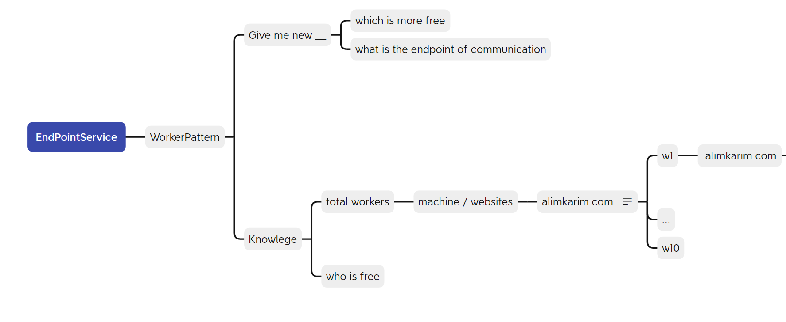

# 05 — Worker Routing

**Spec:** `19-main-worker-service`
**Version:** 1.3.0

> **v1.2.0 (Phase 4 — Backup nodes excluded; "Region" UI label):** The eligibility filter (§1.4) gains a positive guard `IsPrimary(node)` which requires `WorkerNode.IsBackup = 0`. Backup nodes (D8/D9) MUST NEVER appear in any selection strategy's candidate set, including `Manual` (a Power Admin attempting to route to a backup gets `WORKER-300-04 BackupNotRoutable`). RoundRobin cursor walks `WorkerNode.Sequence ASC` over `IsBackup = 0` rows only. The dashboard column previously labelled "Worker" is renamed to **"Region"** in UI copy; the underlying field name stays `WorkerNode` everywhere in code and APIs.

How the Main Server picks which Worker handles a new tenant, caches that decision, and recovers when a Worker fails.

The author's mindmap below frames routing as two questions the Main Server keeps asking: **"Give me new"** (which worker is most free, what's the endpoint of communication) and **"Knowledge"** (total workers, machine/website inventory, who is free). The strategies in §1 are the formal answers.



See also [`images/03-worker-subdomain-routing.png`](./images/03-worker-subdomain-routing.png) for the per-tenant `wN.<domain>` subdomain layout this routing produces.

---

## 1. Selection Strategies

Strategy is configurable via Seedable-Config key `MainWorker.Routing.DefaultStrategy` (canonical default in `16-tunable-constants.md` §2.5). Stored in `WorkerSelectionStrategy` table. Allowed values: `RoundRobin`, `LeastLoaded`, `Manual`. Main MUST refuse to start when the configured value is outside this allow-list (no silent fallback — CODE RED).

### 1.1 `RoundRobin`

- Pick next eligible worker ordered by `WorkerNode.Sequence ASC` (ties broken by `WorkerNodeRegisteredAt ASC`).
- Cursor persisted in main DB (single-row config table or `WorkerSelectionEvent` last-row lookup).
- Pros: trivially predictable, deterministic across restarts. Cons: ignores load.

### 1.2 `LeastLoaded` (**default** — resolves OQ-2)

- Pick `Active` worker with fewest assigned `Company` rows.
- Tiebreaker: oldest `WorkerNodeRegisteredAt`.
- Pros: balances over time. Cons: slightly more expensive query (still O(N) on workers, N is small).

### 1.3 `Manual`

- Power Admin specifies `WorkerNodeId` in the create request.
- Used for testing and reserved-capacity tenants.
- Requires `User has access to EnumPage.PowerAdminPage`.

### 1.4 Eligibility filter (applies to all strategies)

A worker is eligible only if **all** are true (positive guards, per CODE RED):

- `IsPrimary(node)` → `WorkerNode.IsBackup = 0` (Phase 4, D9 — backups never serve traffic).
- `IsWorkerActive(node)` → `WorkerNodeStatusCode = 'Active'`
- `IsWorkerReachable(node)` → last heartbeat within `MainWorker.Heartbeat.IntervalSeconds × MissedThreshold` per `16-tunable-constants.md` §2.3 <!-- TUNABLE-WAIVER: derived product, not a literal -->.
- `HasCapacity(node)` → assigned company count strictly less than `MainWorker.Routing.MaxCompaniesPerWorker`. **NULL = unlimited** (resolves F-A-06; the legacy `0` magic value is rejected — Main MUST refuse to start if the configured value is `0` or negative). When `NULL`, the guard returns `true` unconditionally.

If no eligible worker exists → return `WorkerUnavailable` error per `09-error-contract.md`.

### 1.5 Default selection rationale (resolves OQ-2)

**Decision (Phase 12.3):** `MainWorker.Routing.DefaultStrategy = LeastLoaded`. Pinned in `16-tunable-constants.md` §2.5.

**Why `LeastLoaded` over `RoundRobin`:**

| Criterion | `RoundRobin` | `LeastLoaded` (chosen) | `Manual` |
|---|---|---|---|
| Cold-cluster fairness (workers added at different times) | ❌ Newly added workers stay near-empty until the cursor wraps a full cycle | ✅ New workers get traffic immediately because their company-count starts at zero | n/a |
| Recovery after a worker is quarantined and returns | ❌ Returned worker is one cursor-step behind, gets ~1/N of new tenants | ✅ Returned worker is the most-empty by definition, gets the next assignments | n/a |
| Long-running fairness on uneven tenant lifetimes | ❌ Drifts unboundedly when tenant churn is asymmetric | ✅ Self-correcting — each new assignment compensates for prior imbalance | n/a |
| Predictability for tests & runbooks | ✅ Strictly deterministic order | ⚠️ Deterministic given (counts, tiebreaker) but counts shift | ✅ Operator-pinned |
| Query cost per assignment | O(1) cursor read | O(N) `COUNT(*) GROUP BY WorkerNodeId` over a tiny `WorkerNode` table | O(1) explicit pick |
| Behavior when all workers tied (cold start, same age) | ✅ Walks `Sequence` | ✅ Falls back to `WorkerNodeRegisteredAt ASC` tiebreaker — equivalent to `RoundRobin` first pass | n/a |

**When to override the default:**

| Override to | Use case |
|---|---|
| `RoundRobin` | Synthetic test environments where deterministic assignment ordering is required for replay; benchmark suites that must isolate routing variance from load variance. |
| `Manual` | Reserved-capacity tenants (enterprise contracts pinning to a dedicated worker); incident-response routing during a partial outage; canary-tenant pinning to a worker on a new release channel. |

**What is NOT a reason to override:** "we have only one worker" (any strategy works), "we want fairness" (already optimal), "we want speed" (the O(N) cost on a worker registry of typically 5–50 rows is sub-millisecond and dwarfed by the HTTP round trip).

**Migration path away from the default:** flip `MainWorker.Routing.DefaultStrategy` via Seedable-Config; existing `Company → Worker` mappings are NOT rebalanced (per §3.2 — tenant data lives on the assigned worker). Only **new** company creations observe the new strategy.

---

## 2. Caching

Per memory `mem://architecture/caching-policy`: explicit TTL, deterministic keys, invalidate on mutation.

| Cache key | Value | TTL | Invalidate when |
|-----------|-------|-----|-----------------|
| `MainWorker:Company:{CompanyId}:WorkerNodeId` | INTEGER | 15 min <!-- TUNABLE-WAIVER: cache TTL — owned by caching-policy memory, not MainWorker tunables --> | Worker reassignment, worker offline |
| `MainWorker:Registry:Active` | List of `WorkerNode` | 60 s <!-- TUNABLE-WAIVER: cache TTL — owned by caching-policy memory, not MainWorker tunables --> | Worker register/deregister/status change |
| `MainWorker:Session:{SessionId}:RecentCompanyId` | INTEGER | session lifetime | Logout |

Cache backend: Laravel cache driver (file/redis/memcached) — implementer's choice. The contract is the keys and TTLs above.

---

## 3. Failover

### 3.1 Worker becomes unreachable mid-request

1. Main retries per `16-tunable-constants.md` §2.1 (`RetryMaxAttempts`, `RetryBackoffSeconds`, `RetryJitterPct`).
2. On final failure: surface `WorkerUnreachable` to caller. Do NOT silently reroute — the user's data lives on that specific worker.
3. Log event with `X-Correlation-Id`. Per `02-spec/03-error-manage/`, never swallow.

### 3.2 Worker marked offline

- Background heartbeat checker flips status to `Quarantined` after `MainWorker.Heartbeat.MissedThreshold` consecutive misses (per `16-tunable-constants.md` §2.3); cooldown before re-eligibility = `MainWorker.Heartbeat.QuarantineCooldownSeconds`.
- Existing `Company → Worker` mappings are NOT reassigned automatically. Tenant data is on that worker.
- Power Admin can trigger manual reassignment via `POST /API/V1/Workers/{From}/Migrate/{To}` (deferred — not in initial endpoint set).

### 3.3 Worker comes back online

- On heartbeat resume, status flips to `Active`.
- Existing tenants resume routing automatically.

---

## 4. Migration of Existing Tenants (deferred)

Migrating a `Company` from Worker A → Worker B requires:

1. Quiesce traffic to Worker A for that company.
2. Copy split-DB rows (per `02-spec/05-split-db-architecture/`).
3. Update `Company.WorkerNodeId` on Main.
4. Invalidate routing cache.
5. Resume traffic.

Out of scope for v1.0 — flagged as deferred work. Only `Manual` strategy lets Power Admin influence assignment for new tenants.

---

## 5. Routing Decision Function (pseudocode)

Compliant with CODE RED (≤15 lines, zero nesting, positive guards, max 2 operands):

```php
public function pickWorker(int $companyId, string $strategyCode): WorkerNode
{
    $eligible = $this->getEligibleWorkers();
    $this->guardAtLeastOneEligible($eligible);
    $strategy = $this->strategyResolver->resolve($strategyCode);
    $worker   = $strategy->pick($eligible);
    $this->recordSelectionEvent($companyId, $worker, $strategyCode);
    return $worker;
}
```

Each helper (`getEligibleWorkers`, `guardAtLeastOneEligible`, `recordSelectionEvent`) is its own ≤8-line function. `guardAtLeastOneEligible` throws `WorkerUnavailable` when the list is empty.

### 5.1 Required interfaces (resolves F-A-33)

The pseudocode above relies on two types that implementations MUST define so the contract is portable across PHP, Go, Rust, and TypeScript stacks:

```php
interface WorkerSelectionStrategyInterface {
    /** Returns one WorkerNode from the supplied eligible candidates.
     *  MUST be deterministic given identical input. MUST throw
     *  `WorkerUnavailable` if the input is empty. */
    public function pick(array $candidates): WorkerNode;

    /** Returns the PascalCase code this strategy is registered under
     *  in `WorkerSelectionStrategy` (ref table, see `03-` §2.9). */
    public function code(): string;
}

interface WorkerSelectionStrategyResolverInterface {
    /** Resolves a strategy code to its concrete strategy. MUST throw
     *  `ConfigurationError` if the code is unknown. */
    public function resolve(string $strategyCode): WorkerSelectionStrategyInterface;
}
```

Allowed concrete strategies in v1.0 (one class each, registered by code): `RoundRobin`, `LeastLoaded`, `Manual`. Adding a new strategy = new class + new ref-table row + Seedable-Config bump (per `16-tunable-constants.md` rules); no existing class changes.

---

## 6. Observability

Every selection writes one row to `WorkerSelectionEvent`. Operators can query distribution:

```sql
SELECT WorkerNodeId, COUNT(*) AS Picked
FROM   WorkerSelectionEvent
WHERE  WorkerSelectionEventAt > datetime('now', '-7 days')
GROUP  BY WorkerNodeId
ORDER  BY Picked DESC;
```

---

## 7. Endpoint Schema — see canonical catalogue

The single source of truth for every routing-related endpoint (paths, methods, request/response bodies, auth, idempotency, error codes) is **`07-core-api-endpoints.md`**. This file MUST NOT redefine them. A literal AI implementer MUST read `06-` and ignore any earlier draft of an endpoint catalogue here.

| Concern | Authoritative location |
|---|---|
| Endpoint paths + auth column | `06-` §2 (Endpoint Catalog) |
| Request / response payload shapes | `06-` §3 (Reference Payloads) and the `22-backup-endpoints.md` family for Backup-tier |
| Per-endpoint idempotency rules | `06-` §1 + `16-tunable-constants.md` §2.2 |
| Header contract (`X-Correlation-Id`, `X-Idempotency-Key`, `X-Auth-Action`) | `02-spec/04-database-conventions/07-rest-api-format.md` |
| Error envelope used by every endpoint | `09-error-contract.md` §2 (single envelope) |
| Error codes referenced from endpoints | `14-error-codes.md` §3 |

Routing-specific behavior that is NOT an endpoint contract (selection strategies, cache TTLs, failover rules) lives in §1–§6 above.

---

*Worker routing v1.2.0 — 2026-05-06 (Phase 13.2: §7 endpoint catalogue removed; 06- is the single source of truth)*
