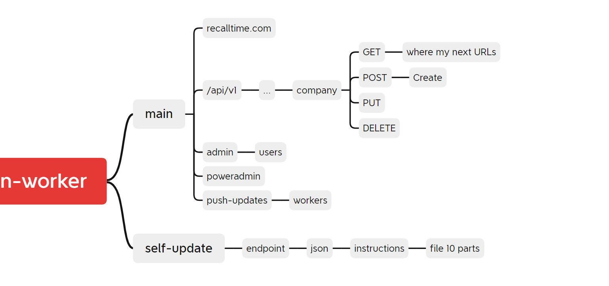

# 10 — Self-Update (Pointer Only)

**Spec:** `19-main-worker-service`
**Version:** 1.2.0
**Status:** 🚧 POINTER ONLY — do NOT implement from this file. Authoritative implementation spec lives elsewhere.

> **Split-DB tier note (FU-3):** Worker bootstrap config and the `WorkerUpdateInstruction` registry both live in the **Settings tier** (worker-wide, not company-scoped) per [`11-worker-bootstrap-protocol.md`](./11-worker-bootstrap-protocol.md) §2 and [`12-split-db-tier-reconciliation.md`](./12-split-db-tier-reconciliation.md) §5. Older drafts that placed `WorkerUpdateInstruction` in the App tier are stale — see FU-5 in `11-…` §8.

The author's mindmap shows self-update as a sibling branch to `main`, with the flow `endpoint → JSON → instructions → file (10 parts)`. The per-worker channel is shown in image 03 (`wN.<domain>/self-update`).

---

## 1. Why this file exists

Per verbatim §Self-Update Mechanism:

> Keep self-update on pause for now. Add a pointer note describing how it will work.

This file is that pointer note. It captures the intent so future implementers (AI or human) know **what** to build, **where** the real spec lives, and **what NOT to do today**.

**Pause expiration (resolves F-A-09 — "for now" had no expiry):** the pause is bounded — this pointer file MUST be deleted (or promoted to a full spec) on whichever comes first:

1. Spec/19-main-worker-service reaches **v2.0.0**, OR
2. The first production deploy of `02-spec/14-update/` self-update lands and is observed green for 14 consecutive days, OR
3. Calendar date **2026-12-31** (hard sunset).

When any condition fires, follow the deletion checklist in §9.

---

## 2. Authoritative Source

Implementation spec: **`02-spec/14-update/`** (existing, do not duplicate).
Memory reference: `mem://features/self-update-architecture` — rename-first deployment, atomicity via `latest.json`.

If `02-spec/14-update/` and this pointer ever conflict, `02-spec/14-update/` wins.

---

## 3. Intended Future Flow (summary, NOT a build instruction)

### Step 1 — Endpoint discovery + redirect caching

1. App calls `POST /API/V1/SelfUpdate` with OAuth/JWT.
2. Endpoint redirects to a download URL.
3. App **saves the redirect URL** to its local DB.
4. Next update cycle: skip the original endpoint, hit the saved URL directly.
5. If saved URL is unreachable OR older than `MainWorker.SelfUpdate.RedirectStaleHours` (default 36h per `16-tunable-constants.md` §2.8), re-resolve via the original endpoint.

### Step 2 — Download + apply

1. Hit redirect URL with auth.
2. Receive a JSON instruction document. **Format spec deferred** — will live in a sibling file under `02-spec/14-update/`.
3. JSON typically contains:
   - One or more zip download URLs.
   - An ordered list of actions (unzip, replace, run-migrations, restart).
   - Source variants (e.g. fall back to GitHub mirror).
4. App unzips, applies actions atomically (rename-first per `mem://features/self-update-architecture`), reports new version.

### Applies to

- Main Server.
- All Worker Nodes.

---

## 4. Push Update vs Self-Update (don't confuse them)

| | Push Update | Self-Update |
|---|---|---|
| Initiator | Power Admin via Main | App itself, on schedule |
| Trigger | `POST /API/V1/Workers/All/Update` or `/{id}/Update` | Cron / scheduler firing per `Settings.UpdateSchedule` |
| Implemented now? | YES — see `07-core-api-endpoints.md` §2.5 and `diagrams/seq-push-update.mmd` | NO — pointer only |

Push Update **invokes** the Worker's `/SelfUpdate` endpoint. The endpoint exists in the spec; its body is deferred.

---

## 5. PowerShell Zip Publish (in scope of this spec)

Per verbatim §Push Update Mechanism.4 — the upload side **is** in scope:

- Endpoint: `POST /API/V1/Workers/PublishZip` (multipart, Power Admin only).
- Auth: Session + `User has access to EnumPage.PushUpdatePage`.
- Behavior: Main stores the zip, fans out to Workers using the stored URL (or pushes the zip directly per a Settings flag).
- Reference: `07-core-api-endpoints.md` §2.5.

The unzip+apply step on the receiving Worker side is part of self-update (deferred).

---

## 6. Update Schedule (in scope, configured here)

Schedule shape and defaults: see `07-core-api-endpoints.md` §4.

| Setting | Allowed values | Default |
|---------|----------------|---------|
| `Cadence` | `Hourly`, `EveryNHours`, `Daily`, `Weekly`, `Monthly`, `Yearly` | `Weekly` |
| `EveryNHours` | 5, 6, 12, 24 | null |
| `SpecificTimeOfDay` | `HH:mm` | `04:00` |
| `TimeZone` | IANA TZ string | `Asia/Kuala_Lumpur` |
| `Enabled` | bool | true |

Implementer wires this to a scheduler (Laravel scheduler / cron / systemd timer). The scheduler invokes `/SelfUpdate` — body of that endpoint is the deferred bit.

---

## 7. What NOT to Do Today

- ❌ Do not implement the JSON-instruction download/apply pipeline from this file.
- ❌ Do not duplicate `02-spec/14-update/` content here.
- ❌ Do not invent a redirect-URL DB schema. When ready, design it under `02-spec/14-update/` and back-link.
- ❌ Do not hard-code source URLs. They live in Seedable-Config.

---

## 8. Cross-References

- **`17-update-channels.md`** — three update channels (push / pull-from-main / pull-from-url) with Kubernetes-style reconciliation. **This is the technical realization of the intent captured here.**
- `02-spec/14-update/` — authoritative self-update spec
- `02-spec/14-update/28-worker-push-instruction.md` — JID schema shared by all channels
- `mem://features/self-update-architecture` — rename-first + `latest.json` rule
- `07-core-api-endpoints.md` §2.5, §2.6, §4 — endpoints + schedule
- `diagrams/seq-push-update.mmd` — push-update sequence (which calls `/SelfUpdate`)

---

## 9. Deletion Checklist (when the pause expires per §1)

When any of §1's three conditions fire, the implementer (or AI agent following this file) MUST:

1. Confirm `02-spec/14-update/` covers every behavior summarised in §3 of this file. Diff §3 against `02-spec/14-update/01-index.md` — any remaining gap blocks deletion.
2. Migrate any inbound links pointing at this file (search: `10-self-update-pointer.md`) to the equivalent anchor in `02-spec/14-update/`. Update `01-index.md`, `29-plan.md`, `99-consistency-report.md`, `98-changelog.md`, and the diagrams' authority footers.
3. Delete this file. Record the deletion in `98-changelog.md` with the triggering condition (`v2.0.0` / `prod-green-14d` / `2026-12-31-sunset`).
4. Re-run the full Step-3 linter pipeline. The `check-spec-cross-links.py` linter will fail if any inbound link was missed; that is the safety net.

---

*Self-update pointer v1.1.0 — 2026-05-04 (F-A-09 closed: pause now bounded with 3-way expiry + deletion checklist)*
