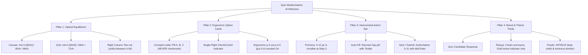

# Specification 06: Quiz System UI/UX Modernization & Optical Equilibrium

**Status:** Approved  
**Priority:** High  
**Parent Epic:** Onboarding Quiz Presentation & Runner UI Modernization  
**Specification Root:** `02-spec/21-app/06-quiz-system-ui-ux-modernization/`  

---

## User Request (Verbatim)

```text
make the UI better please for quiz system it is terrible right now
```

---

## Executive Design Critique & Problem Statement

A thorough visual, ergonomic, and cognitive evaluation of the current quiz presentation engine (`src/components/runner/FormRunner.tsx`) reveals four foundational architectural deficiencies that severely degrade the end-user examination experience:

### 1. Optical Disequilibrium & The Dead Bottom Void
On standard 1080p, 1440p, and high-DPI displays, the quiz presentation canvas collapses question prompts and option groups into the upper 50–55% of the viewport. The existing layout relies on rigid constraints (`min-h-[calc(100dvh-4rem)] lg:min-h-[calc(100dvh-3rem)]`) with uncalibrated flex alignment, leaving an empty, dead void occupying 40–45% of the lower screen. This causes the presentation slide to feel ungrounded, top-heavy, and unanchored rather than occupying an intentional, authoritative presentation canvas.

### 2. Double-Checkmark Visual Pollution & Letter Badge Eradication
In choice-driven questions (`multiple_choice`, `single_choice`, `boolean`, and dual-choice video slides), selecting an option triggers a destructive badge replacement. The left-hand letter pill (`A`, `B`, `C`, `D`) is replaced with a checkmark icon (`<Check />`), while simultaneously an active status indicator (`<CheckCircle2 />`) renders on the far right of the card. This produces two critical design flaws:
- **Destruction of Cognitive Anchor:** Candidates immediately lose visual reference to which option letter (`A`, `B`, `C`, or `D`) they selected, impairing review and quick mental verification.
- **Redundant Visual Clutter:** Displaying two distinct checkmark glyphs on opposite ends of a single card represents visual pollution that violates modern UI standards.

### 3. Sub-Scale Option Card Ergonomics
The current option cards utilize constrained padding (`p-3.5 sm:p-4`), modest corner radii (`rounded-xl`), and undersized letter badges (`w-8 h-8 rounded-lg`). On desktop presentation monitors and tablets, the cards lack tactile presence and visual comfort, appearing cramped and difficult to target compared to modern high-impact testing interfaces.

### 4. Navigation Action Bar Inconsistencies & Layout Shifts
The navigation footer lacks cohesive visual hierarchy:
- The `Previous` button is conditionally disabled at step 0, creating visual inconsistency across sequential steps.
- The `Auto Fill` developer utility uses an unpolished raw unicode emoji (`⚡ Auto Fill`) rather than an integrated SVG icon with appropriate subtle styling.
- The `Next` and `Submit` buttons lack clear keyboard navigation affordances and tactile visual weight, leaving users uncertain about default keyboard interactions (such as the `Enter` key).

---

## Core Architectural Pillars

To address these deficiencies, the modernization overhaul is organized across four foundational pillars:



### Pillar 1: Presentation Canvas Optical Equilibrium
- **Dynamic Viewport Height:** Replace rigid calc formulas with responsive vertical calibration: `min-h-[82vh] lg:min-h-[85vh] xl:min-h-[88vh] flex flex-col justify-center`.
- **2-Column Desktop Grid Sizing:** Calibrate the desktop 2-column grid to `min-h-[60vh] lg:min-h-[68vh] xl:min-h-[72vh] items-center w-full my-auto`.
- **Vertical Flex Distribution:** Structure the right-hand options column as `flex flex-col justify-between h-full` with an anchored footer (`mt-auto`), eliminating dead bottom voids across 1080p and 1440p displays.

### Pillar 2: Ergonomic Option Architecture & Constant Letter Reference
- **Constant Letter Pill (Left):** Option letter badges (`A`, `B`, `C`, etc.) NEVER morph into checkmarks. When selected, the badge retains its letter reference while transitioning to active theme colors (`bg-primary text-primary-foreground border-primary`; or `bg-[#E8C547] text-[#0A0A14] border-[#E8C547]` in Riseup theme).
- **Badge Sizing:** Upgraded from `w-8 h-8` to `w-9 h-9 sm:w-10 sm:h-10 rounded-xl font-mono font-bold text-xs sm:text-sm`.
- **Single Active Indicator (Right):** A single animated `<CheckCircle2 className="w-5 h-5 animate-in zoom-in-75 duration-150 text-primary dark:text-emerald-400" />` (or `text-[#E8C547]` in Riseup theme) on the far right edge of selected cards.
- **Card Ergonomics:** Upgraded padding to `p-4 sm:p-4.5 lg:p-5`, corner radius to `rounded-2xl`, and border treatment to `border-border/60` with smooth `.presentation-option-card` hover sliding motion (`translate3d(6px, 0, 0)`).

### Pillar 3: Harmonized Navigation Action Bar
- **Previous Action:** Standardized to `h-11 px-4 rounded-xl` with `<ChevronLeft className="w-4 h-4 mr-1.5" />`. At step 0, it renders with `invisible pointer-events-none` to eliminate jarring layout shifts while maintaining alignment.
- **Auto Fill Utility:** Refined into a discreet utility pill with `<Zap className="w-3.5 h-3.5 text-amber-500/80 mr-1.5" />`, eliminating raw emojis.
- **Advance / Submit Action:** Authoritative primary action styled as `h-11 px-6 sm:px-7 rounded-xl font-bold bg-primary text-primary-foreground shadow-sm` equipped with a tactile keyboard hint `<kbd className="text-[10px] font-mono px-1.5 py-0.5 rounded bg-primary-foreground/20 text-primary-foreground">↵</kbd>`.

### Pillar 4: Brand & Theme Parity
- **Zero Candidate Response:** Permanent elimination of any `Candidate Response` label or artifact from all runner views and DOM nodes.
- **Riseup Brand Palette:** Strict adherence to Prompt Architect Rule 9: dark navy background (`#0A0A14`), cream primary text (`#F7F1E6`), and gold (`#E8C547`) strictly reserved as an active indicator mark (radio dot, active checkmark, progress hairline), never as body text or title highlights.
- **Hairline Chrome Accent:** 2px hairline accent edge (`h-0.5 w-16 rounded-full shadow-md mb-3`) above question stems.

---

## Acceptance Criteria

| ID | Category | Requirement Description | Verification Method |
| :--- | :--- | :--- | :--- |
| **AC-01** | Canvas Equilibrium | Canvas container utilizes `min-h-[82vh] lg:min-h-[85vh] xl:min-h-[88vh] flex flex-col justify-center` in `FormRunner.tsx`. | DOM inspection & CSS assertion in runner specs |
| **AC-02** | 2-Column Grid Sizing | The 2-column presentation grid applies `min-h-[60vh] lg:min-h-[68vh] xl:min-h-[72vh] items-center w-full my-auto`. | Component layout verification on 1080p viewport |
| **AC-03** | Right-Column Flex | Right-hand answer container implements `flex flex-col justify-between h-full` with footer anchored via `mt-auto`. | Visual test verifying zero dead void in lower 40% |
| **AC-04** | Constant Letter Badge | Letter badge (`A`, `B`, `C`, etc.) preserves the letter character when selected; zero `<Check />` icon replaces the letter. | Unit test asserting badge text equals letter glyph when checked |
| **AC-05** | Single Active Indicator | Only one `<CheckCircle2 />` icon renders per selected card on the far-right edge; zero double-checkmark instances exist. | DOM query asserting exactly one check icon per active card |
| **AC-06** | Badge Dimensions | Letter badges render at `w-9 h-9 sm:w-10 sm:h-10 rounded-xl font-mono font-bold`. | CSS class list assertion in unit tests |
| **AC-07** | Card Ergonomics | Choice cards apply `p-4 sm:p-4.5 lg:p-5`, `rounded-2xl`, and `border-border/60`. | Class list assertion on choice card labels |
| **AC-08** | Navigation Previous | Previous button uses `h-11 px-4 rounded-xl` with `<ChevronLeft className="w-4 h-4" />` and `invisible` at step 0. | Step 0 render test verifying invisible presence |
| **AC-09** | Navigation Auto Fill | Auto Fill button renders `<Zap className="w-3.5 h-3.5 text-amber-500/80" />` with tooltip; no raw emoji `⚡` present. | Text query asserting absence of emoji and presence of Lucide Zap |
| **AC-10** | Navigation Next / Submit | Next/Submit buttons render at `h-11 px-6 sm:px-7 rounded-xl font-bold` with tactile `<kbd>` Enter keycap. | DOM query for `<kbd>` element with `↵` symbol |
| **AC-11** | Zero Candidate Response | Zero occurrences of `Candidate Response` exist in runner views or DOM nodes. | RegEx search across JSX and `screen.queryByText(/candidate response/i) === null` |
| **AC-12** | Riseup Theme Parity | Acronyms render in cream `#F7F1E6`; gold `#E8C547` strictly applied as active indicator mark. | Style/theme assertion in Riseup test fixtures |

---

## Document Cross-References

- `02-spec/21-app/06-quiz-system-ui-ux-modernization/02-optical-equilibrium-and-options-ux.md` — Detailed technical specifications, JSX layouts, and styling tokens.
- `.ai-memory/plans/pending/15-quiz-system-ui-ux-modernization.md` — Subtask decomposition, execution sequence, and verification gates.
