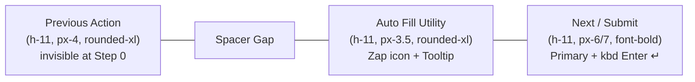

# Specification 06: Component Spec 02 — Optical Equilibrium, Option Cards & Navigation UX

**Status:** Approved  
**Priority:** High  
**Parent Spec:** `02-spec/21-app/06-quiz-system-ui-ux-modernization/`  
**Area:** `src/components/runner/FormRunner.tsx`, Presentation Layout, Choice Badges, Navigation Bar  

---

## 1. Presentation Canvas Optical Equilibrium Architecture

### 1.1 The Dead Bottom Void Problem Analysis
In the legacy implementation of `src/components/runner/FormRunner.tsx`, the presentation canvas used a viewport container bound by:
```tsx
/* Legacy Container with Dead Bottom Void */
className={`w-full min-h-[calc(100dvh-4rem)] lg:min-h-[calc(100dvh-3rem)] flex flex-col justify-center ...`}
```
On high-resolution desktop displays (1080p, 1440p, 4K), this implementation collapses the question prompt and option cards into the upper 50–55% of the viewport. Because the internal column grid lacked calibrated vertical constraints, the entire assessment card floated awkwardly near the top, leaving an unanchored, dead empty void occupying 40–45% of the lower viewport.

### 1.2 Calibrated Viewport Canvas Tokens
The presentation canvas container must replace the legacy rigid calculation with responsive viewport-calibrated minimum heights:

```tsx
/* Modernized Viewport Canvas Container */
<div
  key={currentField.id}
  className={`w-full min-h-[82vh] lg:min-h-[85vh] xl:min-h-[88vh] flex flex-col justify-center bg-transparent border-0 rounded-none shadow-none px-4 sm:px-8 lg:px-12 py-4 relative ${activeTransitionClass}`}
>
```

### 1.3 2-Column Desktop Grid Sizing
To maintain optical equilibrium between the question prompt (left column) and the interactive choices (right column), the grid container is calibrated with explicit vertical boundaries:

```tsx
/* 2-Column Desktop Presentation Grid */
<div className="grid grid-cols-1 lg:grid-cols-2 gap-8 lg:gap-12 xl:gap-16 items-center w-full my-auto min-h-[60vh] lg:min-h-[68vh] xl:min-h-[72vh]">
  {/* Left Column: Vertically Centered Question Title & Context */}
  <div className={`w-full space-y-6 flex flex-col justify-center lg:self-center ${effectiveAnswerPlacement === 'left' || effectiveLayoutMode === 'split_left' ? 'lg:order-2' : 'lg:order-1'}`}>
    {...}
  </div>

  {/* Right Column: Anchored Vertical Flex Flow */}
  <div className={`w-full space-y-6 flex flex-col justify-between h-full pt-2 lg:pt-6 xl:pt-8 ${effectiveAnswerPlacement === 'left' || effectiveLayoutMode === 'split_left' ? 'lg:order-1' : 'lg:order-2'}`}>
    {...}
  </div>
</div>
```

### 1.4 Right-Hand Column Vertical Flex Distribution
The right-hand options column must distribute its interactive choices and navigation controls harmoniously across the available canvas height:
1. **Full-Height Flex Container:** Set to `flex flex-col justify-between h-full`.
2. **Options Group Stack:** Top container wrapping choices with `space-y-4 w-full`.
3. **Anchored Action Bar Footer:** Bottom container utilizing `mt-auto pt-6 flex flex-col sm:flex-row items-center justify-between gap-3 w-full`.

This layout ensures that on tall desktop screens, the options occupy their natural comfortable reading space while the action bar firmly anchors to the bottom margin of the calibrated grid, permanently eliminating the dead bottom void.

---

## 2. Option Cards UX Redesign & Elimination of Double-Checkmark

### 2.1 The Double-Checkmark & Disorientation Flaw
In the legacy implementation of `renderFieldInput` across `multiple_choice`, `single_choice`, and `boolean` fields:
```tsx
/* Flawed Legacy Implementation */
<span className="option-badge ...">
  {isSelected ? <Check className="w-4 h-4 stroke-[3]" /> : String.fromCharCode(65 + optIndex)}
</span>
...
{isSelected && (
  <CheckCircle2 className="w-5 h-5 shrink-0 ml-auto ..." />
)}
```
When selected, the left letter badge (`A`, `B`, `C`, `D`) was destroyed and replaced with a `<Check />` icon, while a second `<CheckCircle2 />` icon rendered on the right. Candidates lost track of which option letter they selected, and the card suffered from visual clutter with two redundant checkmarks.

### 2.2 Constant Letter Pill Specification (Left)
The option letter badge must NEVER turn into a checkmark. It must always display the canonical option letter (`A`, `B`, `C`, etc.) regardless of whether the card is selected or unselected.

```tsx
/* Constant Letter Badge Pill */
<span
  className={`option-badge w-9 h-9 sm:w-10 sm:h-10 rounded-xl font-mono font-bold text-xs sm:text-sm border flex items-center justify-center shrink-0 transition-all duration-200 ${
    isSelected
      ? isRiseupTheme
        ? 'bg-[#E8C547] text-[#0A0A14] border-[#E8C547] shadow-xs'
        : 'bg-primary text-primary-foreground border-primary shadow-xs'
      : 'bg-muted/70 text-muted-foreground border-border/70'
  }`}
>
  {String.fromCharCode(65 + optIndex)}
</span>
```

Key invariant rules:
- **Never Render `<Check />` in the Badge:** The child expression is strictly `String.fromCharCode(65 + optIndex)` (or `String.fromCharCode(65 + options.length)` for the Other choice).
- **Active State Transition:** When selected, the badge pill transitions background and border to primary theme colors (`bg-primary text-primary-foreground border-primary`; or `bg-[#E8C547] text-[#0A0A14] border-[#E8C547]` for Riseup theme).
- **Expanded Dimensions:** Upgraded from `w-8 h-8 rounded-lg` to `w-9 h-9 sm:w-10 sm:h-10 rounded-xl font-mono font-bold text-xs sm:text-sm`.

### 2.3 Option Text (Center)
The option label occupies the center space with fluid typography and enhanced contrast:
```tsx
<span className="option-text option-text-shadow flex-1 font-sans text-sm sm:text-base font-medium text-foreground/90 leading-snug transition-colors duration-200">
  {opt}
</span>
```

### 2.4 Single Active Indicator (Right)
A single confirmation glyph renders on the far-right edge of the card, exclusively when `isSelected` is true:
```tsx
{isSelected && (
  <CheckCircle2
    className={`w-5 h-5 shrink-0 ml-auto animate-in zoom-in-75 duration-150 ${
      isRiseupTheme ? 'text-[#E8C547]' : 'text-primary dark:text-emerald-400'
    }`}
  />
)}
```

### 2.5 Option Card Ergonomics & Motion
Choice cards across all field types are upgraded to modern presentation standards:
```tsx
<label
  key={opt}
  className={`flex items-center gap-3.5 sm:gap-4 p-4 sm:p-4.5 lg:p-5 rounded-2xl text-sm sm:text-base font-sans font-medium cursor-pointer border ${choiceMotionClass} ${staggerClass} ${
    isSelected
      ? isRiseupTheme
        ? 'bg-[rgba(232,197,71,0.08)] border-[#E8C547] text-foreground font-semibold shadow-xs ring-1 ring-[#E8C547]/40 opacity-100'
        : 'bg-primary/15 border-primary text-foreground font-semibold shadow-xs ring-1 ring-primary/40 opacity-100'
      : 'bg-card/75 border-border/60 text-foreground/80 hover:text-foreground'
  }`}
>
  {/* Constant Letter Pill (Left) */}
  {/* SR-only Checkbox/Radio Input */}
  {/* Option Text (Center) */}
  {/* Single Active Indicator (Right) */}
</label>
```

### 2.6 Dual-Choice Video Buttons Parity
In slide video questions with dual choices (e.g. Yes/No, A/B), the same constant letter pill and single active indicator standard applies:
```tsx
<Button
  key={choice}
  type="button"
  size="lg"
  variant={isSelected ? 'default' : 'outline'}
  onClick={() => handleAnswerChange(currentField.id, choice)}
  className={`flex-1 w-full sm:w-auto h-12 px-6 rounded-xl font-heading font-semibold text-base transition-all duration-200 flex items-center justify-center gap-3 shadow-sm hover:translate-x-1 cursor-pointer ${
    isSelected
      ? isRiseupTheme
        ? 'bg-[#E8C547] text-[#0A0A14] border-[#E8C547] shadow-md ring-2 ring-[#E8C547]/30'
        : 'bg-primary text-primary-foreground border-primary shadow-md ring-2 ring-primary/30'
      : 'border-border/60 bg-card text-foreground hover:bg-muted/70 hover:border-foreground/30'
  }`}
>
  <span className={`w-7 h-7 rounded-lg flex items-center justify-center text-xs font-mono font-bold shrink-0 ${
    isSelected
      ? isRiseupTheme
        ? 'bg-[#0A0A14] text-[#E8C547]'
        : 'bg-primary-foreground text-primary'
      : 'bg-muted text-muted-foreground'
  }`}>
    {String.fromCharCode(65 + cIdx)}
  </span>
  <span className="truncate">{choice}</span>
  {isSelected && (
    <CheckCircle2 className={`w-4 h-4 ml-auto sm:ml-1 shrink-0 ${isRiseupTheme ? 'text-[#0A0A14]' : 'text-primary-foreground'}`} />
  )}
</Button>
```

---

## 3. Harmonized Navigation Action Bar Specification

The navigation footer at the base of the options column must provide tactile clarity, reliable keyboard navigation, and seamless state transitions.



### 3.1 Previous Action (Left Anchor)
- **Dimensions:** `h-11 px-4 rounded-xl text-xs sm:text-sm font-medium`.
- **Icon:** `<ChevronLeft className="w-4 h-4 mr-1.5 shrink-0" />`.
- **Zero Layout Shift at Step 0:** Instead of conditionally omitting the button or disabling it with awkward opacity, render with `invisible pointer-events-none` when `currentStep === 0`. This preserves the flex layout dimensions and ensures the Auto Fill and Next buttons do not jump when moving from step 0 to step 1.

```tsx
<Button
  type="button"
  variant="ghost"
  size="sm"
  onClick={handlePreviousStep}
  className={`btn-tactile-spring text-xs sm:text-sm h-11 px-4 font-medium text-muted-foreground hover:text-foreground hover:bg-muted/50 cursor-pointer rounded-xl transition-all flex items-center gap-1.5 ${
    currentStep === 0 ? 'invisible pointer-events-none' : ''
  }`}
>
  <ChevronLeft className="w-4 h-4 shrink-0" />
  <span>Previous</span>
</Button>
```

### 3.2 Auto Fill Utility Action (Right Group)
- **Dimensions:** `h-11 px-3.5 rounded-xl text-xs font-medium`.
- **Icon & Typography:** Discreet utility pill with `<Zap className="w-3.5 h-3.5 text-amber-500/80 mr-1.5 shrink-0" />` followed by `Auto Fill`. The unpolished unicode emoji `⚡` is completely removed.
- **Tooltip Integration:** Wrapped in a `<Tooltip>` component displaying `Fill valid answer and advance`.

```tsx
<Tooltip>
  <TooltipTrigger asChild>
    <Button
      type="button"
      variant="ghost"
      size="sm"
      onClick={handleTestAutoFill}
      className="btn-tactile-spring text-xs h-11 px-3.5 font-medium rounded-xl text-muted-foreground hover:text-foreground hover:bg-muted/50 transition-all cursor-pointer flex items-center gap-1.5"
    >
      <Zap className="w-3.5 h-3.5 text-amber-500/80 shrink-0" />
      <span>Auto Fill</span>
    </Button>
  </TooltipTrigger>
  <TooltipContent>Fill valid answer and advance</TooltipContent>
</Tooltip>
```

### 3.3 Next Question / Submit Assessment Action (Right Anchor)
- **Dimensions:** Authoritative primary button `h-11 px-6 sm:px-7 rounded-xl font-bold bg-primary hover:bg-primary/90 text-primary-foreground shadow-sm flex items-center gap-2.5 cursor-pointer active:scale-[0.98] transition-all`.
- **Tactile Keycap Affordance:** Explicit `<kbd>` markup rendering the enter key symbol `↵`:
  ```tsx
  <kbd className="text-[10px] font-mono px-1.5 py-0.5 rounded bg-primary-foreground/20 text-primary-foreground font-semibold ml-1">
    ↵
  </kbd>
  ```
- **Conditional Labeling:**
  - Intermediate Steps: `<span>Next Question</span>`
  - Final Assessment Step (`isLastVisibleStep`): `<span>Submit Assessment</span>`

```tsx
{isLastVisibleStep ? (
  <Button
    type="button"
    size="sm"
    onClick={handleNextStep}
    className="btn-tactile-spring text-xs sm:text-sm h-11 px-6 sm:px-7 font-bold bg-primary hover:bg-primary/90 text-primary-foreground shadow-sm cursor-pointer flex items-center gap-2 flex-1 sm:flex-initial justify-center rounded-xl active:scale-[0.98] transition-all"
  >
    <span>Submit Assessment</span>
    <kbd className="text-[10px] font-mono px-1.5 py-0.5 rounded bg-primary-foreground/20 text-primary-foreground font-semibold ml-1">
      ↵
    </kbd>
  </Button>
) : (
  <Button
    type="button"
    size="sm"
    onClick={handleNextStep}
    className="btn-tactile-spring text-xs sm:text-sm h-11 px-6 sm:px-7 font-bold bg-primary hover:bg-primary/90 text-primary-foreground shadow-sm cursor-pointer flex items-center gap-2 flex-1 sm:flex-initial justify-center rounded-xl active:scale-[0.98] transition-all"
  >
    <span>Next Question</span>
    <kbd className="text-[10px] font-mono px-1.5 py-0.5 rounded bg-primary-foreground/20 text-primary-foreground font-semibold ml-1">
      ↵
    </kbd>
  </Button>
)}
```

---

## 4. Typography & Stem Indicator Refinement

### 4.1 Optical Centering of the Question Stem
The left column prompt is vertically centered in the slide canvas to establish optical equilibrium with the right-hand options column:
```tsx
<div className={`w-full space-y-6 flex flex-col justify-center lg:self-center ${effectiveAnswerPlacement === 'left' || effectiveLayoutMode === 'split_left' ? 'lg:order-2' : 'lg:order-1'}`}>
  {/* Hairline Chrome Accent (2px) */}
  {isRiseupTheme ? (
    <div className="h-0.5 w-16 bg-[#E8C547] rounded-full shadow-md mb-3" />
  ) : (
    <div className="h-0.5 w-16 bg-primary rounded-full shadow-md mb-3" />
  )}

  <h2 className={`font-heading font-bold ${dynamicTitleTypography} text-foreground tracking-tight`}>
    {renderHighlightedQuestionTitle(
      currentField.label,
      (currentField as FormField & { highlightWord?: string }).highlightWord,
      isRiseupTheme
    )}
    {isCurrentFieldRequired && (
      <span className="text-destructive font-bold ml-1.5" title="Required question">*</span>
    )}
  </h2>
  ...
</div>
```

### 4.2 Riseup Brand Guidelines Alignment
Strict adherence to Prompt Architect Rule 9:
1. **Acronym Highlighting:** Technical terms (e.g. `HTML`, `CSS`, `API`) in question titles must be highlighted in cream (`#F7F1E6`) with `font-extrabold tracking-wide drop-shadow-xs`.
2. **Gold Reservation:** Gold (`#E8C547`) is strictly an active indicator mark (e.g. selected radio indicator, checkmark icon, hairline chrome accent edge), NEVER a dominant surface or body text color.

### 4.3 Permanent Zero-Tolerance Ban on "Candidate Response"
Under no circumstances may any label or element with the text `Candidate Response`, `CANDIDATE RESPONSE`, or related badge marks exist in the runner DOM or JSX tree. Options render directly within the clean, unboxed, elevated presentation column.
