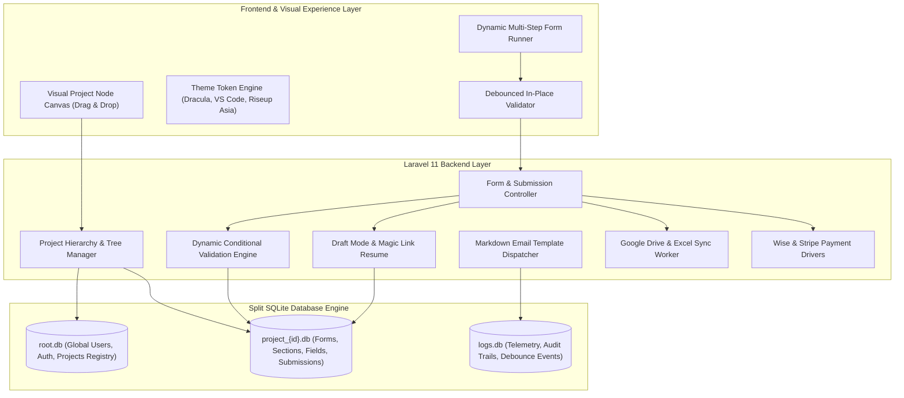

# Forms Specification & Laravel Application Architecture — Overview

> **Module:** `02-spec/21-app/21f-forms-spec/`  
> **Version:** `1.0.0`  
> **Status:** `Canonical Specification`  
> **Stack:** Laravel 11.x Backend (First-Class), Split SQLite Multi-Database Engine, React SPA / Vue Visual Builder, Tailwind CSS & Less Engine, WordPress Plugin Target (Subsequent Packaging)

---

## 1. Executive Summary & Architectural Direction

This specification establishes the canonical design for the **WP Exam & Universal Form Engine**, developed **first as a standalone, enterprise-grade Laravel application**, and architected to be seamlessly packaged into a WordPress plugin as a secondary delivery phase.

The platform provides a unified visual workflow system combining:
1. **Interactive Visual Project Node Tree:** A drag-and-drop graph canvas allowing project creators to link parent projects to recursive sub-projects, define prerequisite gates, and construct multi-stage execution pipelines.
2. **Dynamic Conditional Form & Exam Engine:** A modern, fluid, responsive form runner supporting deep branching logic where dropdowns, radios, and buttons dynamically show/hide field blocks with smooth transitions, mutate required validation constraints on the fly, and synchronize authoritative server-side validation.
3. **Split SQLite Database Architecture:** Every project operates within an isolated, self-contained SQLite database file (`project_<id>.db`) backed by Write-Ahead Logging (WAL) and 1-to-many normalized joins, maximizing query throughput while drastically reducing file size and enabling instantaneous backup, export, and import.
4. **Rich Multi-Media & Advanced Assessments:** Support for video questions, video answers, audio/voice prompts, SVG/image MCQ choices, interactive sliders, fractions/numeric ranges, and automated formatters (e.g. WhatsApp international link builder with interactive ping tests).
5. **Real-Time Debounced Client Validation + Authoritative Server Guards:** Sub-second in-place client validation debounced to protect backend resources, backed by server-side dynamic requirement resolution and anti-bot protection (CAPTCHA/reCAPTCHA).
6. **Multi-Stage Applicant Workflows & Email Automation:** Asynchronous task dispatch, candidate progress tracking, and admin triage with templated markdown notifications modeled after the Antigravity Manager (AGM) mail architecture.
7. **External Sync & Payment Gateways:** Cloud backup synchronization with Google Drive and Excel sheets via OAuth, accompanied by pluggable payment gateways (Wise and Stripe).

---

## 2. Core Architectural Pillars



---

## 3. High-Level Feature Inventory

### 3.1 Visual Project Node Tree (Drag & Drop)
- **Interactive Graph Canvas:** Renders projects, sub-projects, and dependencies as connected node graphs.
- **Visual Connection Anchors:** Allows dragging connector lines between parent projects and child sub-projects to define prerequisites and sequential milestones.
- **Topological Integrity:** Real-time cycle detection preventing circular dependencies.
- **JSON Import/Export:** 100% loss-free serialization of project hierarchies, form structures, and section flows to portable JSON manifests.

### 3.2 Dynamic Form & Assessment Engine
- **Multi-Step Wizard:** Step-by-step navigation with responsive step tickers, breadcrumbs, and animated progress indicators.
- **Conditional Visibility Matrix:** Selecting or changing a dropdown/radio value dynamically alters the visibility of child sections and inputs, accompanied by smooth height and opacity transitions.
- **Dynamic Requiredness:** Fields hidden by conditional logic automatically become non-required on both client and server; the Laravel validator recalculates required rules dynamically based on submitted branch state.
- **Prefix Automation & Formatters:** Automated formatting for international phone numbers and WhatsApp URLs (`https://wa.me/+{country}{number}`) with an integrated "Test WhatsApp Link" trigger.
- **Static Country Database:** Pre-cached static country dictionary with ISO-3166-1 codes, international calling prefixes, IP-based geolocation pre-selection, and flag renderers.
- **Rich MCQ & Media Assessments:** Questions can present rich video embeds, voice/audio prompts, SVGs, or images; candidate answer choices can include interactive radio cards with video previews or image thumbnails.
- **URL & Pattern Validation:** Specialized validators for Google Drive/Docs links (`https://drive.google.com/...`), LinkedIn, GitHub, portfolio websites, and custom regex strings.
- **Debounced Validation:** Rapid typing is throttled via a configurable debounce window (300ms–500ms) before hitting server endpoints.
- **Security & Anti-Bot:** Integrated Google reCAPTCHA v3 / Cloudflare Turnstile, cryptographic CSRF tokens, and IP rate limiting.

### 3.3 Draft Mode & Progress Retention
- **Dual-Storage Strategy:** Form drafts are preserved in the user's browser via `IndexedDB` / `localStorage` and synchronized with the backend.
- **One-Click Email Magic Link:** Candidates can click "Save Draft", provide their email, and receive a secure tokenized URL (`/apply/resume/{token}`) allowing seamless continuation across devices.
- **Split SQLite Persistence:** Draft payloads are stored directly in `project_<id>.db` in a dedicated `Draft` table.

### 3.4 Multi-Stage Evaluation & Automated Dispatch
- **Multi-Step Applicant Pipeline:** Candidates advance through progressive stages (e.g., Application Submission → Pre-Screen Review → Video Interview → Technical Challenge → Final Offer).
- **Automated Email Dispatch:** Email triggers dispatched automatically upon milestone transitions, using Markdown templates supporting `${variable}` and `{{$variable}}` interpolation (inspired by the Antigravity Manager / AGM engine).
- **Admin Triage & Review:** Dedicated admin console for reviewing applicant submissions, viewing uploaded screenshots and CV links, inspecting video answers, and scoring candidates.

### 3.5 External Sync & Pluggable Payments
- **Google Drive & Excel Sync:** Automated background workers pushing form submissions to Google Drive folders and syncing rows to Google Sheets / Microsoft Excel workbooks via OAuth 2.0.
- **Payment Gateways:** Modular driver interface supporting Stripe Checkout/Elements and Wise API for application fees, paid certifications, or exam enrollments.

### 3.6 Theme System & CSS Optimization
- **JSON Theme Manifests:** Easily loadable theme presets including:
  - *Light & Dark Adaptive*
  - *VS Code Dark Modern*
  - *Antigravity Dracula*
  - *Microsoft Blue*
  - *Riseup Asia Corporate Palette*
  - *Job Forms Modern Purple*
- **Less & Tailwind Architecture:** Utility classes compiled into optimized, semantic, lowercase-hyphenated Less/CSS classes to minimize stylesheet footprint and DOM clutter.

---

## 4. User Request (Verbatim)

The following requirements and design notes were provided by the user and represent the authoritative functional vision for this specification:

```text
https://careers.developers-organism.com/apply/?job=Intern+Programmer
D:\work\wp-exam\assets
https://prnt.sc/18rPR823nVfV
https://prnt.sc/UkvpjmvVoyMp
https://prnt.sc/JjLdkHXdBzPS


Instructions

Okay. So I wanted to start with the WP exam specification. That would be a detailed specification. So the first thing I want you to do is to write to the file system what the specifications. Also at the same time, I want you to read the full repo to understand that what is going on in the past knowledge and what we have written and things like that. Okay. Once you have this information, you can basically have... Because we have written some spec. If you go to the spec folder, and if you go to folder 21, there are some previous discussion, and other stuff, which I want you to understand first. And this is additional on top of it, how I see this visualization. Okay? So most of all, I want this to be utilized first as a Laravel application, not anything else. And then we will come to make a WordPress plugin later on, same thing. I'm not sure, you can confirm how the specs are written at the moment. So first thing, yes, I want to have the Laravel app, and then I want to make the Laravel app. So the way that it would work, it would have the back-end, it would have this backup, export, import, project creation, project connected with sub-project. It will show as a node tree, which I can drag, drop to connect. These are the features I have discussed. Okay. Now, we are going to go deep, like how a form or a project creation would work. For example, I have a, let's say, carrier page, which I am going to share that with you. Okay? Which you should actually go through, utilize the HTML, CSS, and try to fill out the form and go to the next page as well, if you can, to understand the visualization that what can be possible. The site that I'm giving you, this is basically a WordPress site. Okay? And also, I am going to give you the images from the assets folder. I have given you the path. Your job is to explain to AI that these type of forms are also possible to create using our tool. We can create a block of section as a description. We can have a dropdown. The dropdown can be fixed, dropdown can be changed. Changing on the dropdown can change the fields, can change required fields. Every field can have a server-side validation, which we can define from the back end. We can have fields, radio button or different UI concept. So try to use the modern UI templates and things so that the UI looks very much modern. This one that you see is not very much modern. Okay? It's very old. It also have FAQ section. So in places we could provide YouTube videos or even embedding video. Depending on the question, the video can come. They have to answer certain things, certain text boxes. Certain text boxes can have URL-based validation, regex-based validation. It starts with validation, ends with validation. Emails, providing the email can have certain types of restriction. We can select the email field, we can have the email validation, that's for sure. So the validations will work as soon as we type. Okay? Now, if the user is typing too fast, then it would debounce it. It would not make me too much of the request to the server. Remember, those user is very much dangerous. They could hack the system. So for this, when you display these forms, in the back end, you need to have, let's say, CAPTCHA, reCAPTCHA, things like that. You can have, let's say, form validation or let's say, a QR way to go to the next page, things like that. So many things are possible. Also, in the future, we can integrate the payment gateways, and we will discuss about the payment gateways. Usually, we will introduce Wise and Stripe. These are the two payment gateways that we wanted to include. Probably one will do the work. So for this, you can do the research to see with Laravel, which actually works best. Okay. So these are on top of my head. For example, when we are giving the number here, especially in the WhatsApp section, okay? In the WhatsApp section, we want the format to have a certain way to put it, right? So here we have given the placeholder. That's correct. But when we type it, the error message cannot be customized in this system. But we should have a flexible system where the error message can be customized so that user can understand what is the right format. Or also what we could do is, we could have all the systems for every field. Remember that it's not for only one field, but any field, this automation. So what we can also select a prefix automation, like this case, the WhatsApp format system. So user can just put the number in, and they could If they do not put the additional stuff, it would automatically fix that number thing, and they could also have a button to test their WhatsApp if it is working. Also, for the country fields, we could not provide the country list. So we should have a country pre-filled database system, which automatically cache in the static variable in the system so that it never runs again, because country is always static. And also when we give the phone number, we can select the country that would automatically put the country code, and then they will put the number. Also, I'm not sure if it is quite possible with Laravel by default. Based on the IP, it would automatically detect the country as well in the system. And then from the country, it would pick the country flag. So country flag is another option I think we should have, in the country section, also in the phone number section, which we don't have here. Some fields can be number and fraction. We can design this from the back end, and also can customize it in place. So depending on buttons, let's say radio button, checks, or dropdown, the form can fully change. Let's say a form field was required in the previous, let's say dropdown. Now changing that hides those field. So you can have some animation and hide those fields. And those hidden fields will be, let's say, not be required. Now, there are two factors now. When we do the server-side coding, the server should actually know that this field is... That's important. Based on this other, let's say, dropdown. So server side, the programming needs to be very accurate, and it should validate and tell us all these validations error as soon as we try to go to the next page. Now, server will know that, yes, even though the, let's say, field is missing, but since they have selected another dropdown, selecting on a new dropdown changes the field requiredness to different ones. And in those case, the backend server will be that much, let's say, powerful to detect that what is the right field. And it should validate and compile all in work together and compile back to the user. Also, they will have in-place validation. Some of the fields will have the server validation as well. But not all the fields. Okay? And also, if you are designing a form, a form can have a video that they could watch. And also from the user perspective, what I want is that they could save the data as a draft mode. So every page that they go, they could just pick a draft mode. And again, they can continue when they come back. The way that draft mode would work, first of all, that could use, let's say, email to save the user information so that they can get back with that same email and, let's say, one-click validation. That is one way to go. So that means in the server side, we should have a mail configuration where we put the mail information. For this, I think you can also look into the AGM project, which is the Antigravity Manager Project, where we have integrated the emails. Okay? Nicely, it can read the email server, email, can read and send back, both it can do. Okay? So that is a nice choice, I think. Then if we look into this, so that means they could create a on-the-fly email by, first one, they could just provide their email based on the dropdown, and they proceed to the next. So they save their email address. This is one way. Also, it would be depending on the system designer, how they want their project. They could also select, let's say, IndexedDB or let's say local storage. So depending on how we interact with the project, the shifts can verify and change. And by default, we will be focusing on the SplitDB for each project to save the information. Okay? Remember that. SplitDB using SQLite database. So that would be our main go-to thing. So I want you to read the SplitDB concept carefully to understand this part. Okay. I think we are in a good shape at this point. Now, once we go to the next page, it should show a progress bar. The progress bar, we can decide how the progress bar would show up. Okay? And depending on either mobile or something else, we can actually make things different. So mobile screen, we can make things different. Desktop screen, we can make things just different. Okay? And also every UI that we actually show, usually our best guess would be UI should be very much fluid responsive so that it works on most of the places nicely. But user will have all the options to customize and add more features, make it lucrative. There could be some detail section user can add, drag, drop. These type of things user can do from the back-end side. Also based on project registered user, the system can send tasks automatically revert back with multi-step things. Let's say in one project, they have to do certain step. They send an email. The system will verify, an admin will verify the results that they have done. They will put them to next stage, and they could go there, next stage, and then they will perform the next step. So this is how you could have multi-step, let's say, email by email validation step in one project. So in each project, we can have section type. Okay? The section would be the group of items that it's going to perform. So we can say one section depends on another section. And we can actually use the same concept with projects. Okay? Yeah. We can share the projects, other stuff. Okay. I think you have got the whole picture. We can also create some, let's say... So current validation looks like this, but I want this to be more professional. Okay? And color and everything should be changeable with multiple themes. The themes can be changed and imported using JSON. So that is very important. So your JSON would be go to element. Using this, we can share many more stuff. Okay? You can also have FAQ based system where we could add FAQs people would read and check. Until the FAQs are checked, we can say you cannot go to the next step. So animation and default stuff that we can have that would make the FAQs nice. Okay. I think this is really good. Also the padding, other steps, other things. We can do a pre-step, pre-form. Okay? Many more things we could do. I hope you get the full mental picture. Okay? And whole thing, we can have a instruction set for LLM where we can just drop the MD file, that using that, any LLM would understand how the project and things are structured using JSON, and we can import, export using JSON. But when we insert to the database system, it would actually use the SQLite, and it would use the one too many joins to keep the database normalized and try to keep the database size as small as possible, so that searching and other parts are very smooth. Also, in the back end side, we want to have some Excel type things, and also we can have different types of email categories. What do I mean by that? Every action, I could have some email using email templates. The templates can also be changed using an MD file to LLM models, and it can actually provide the email template with certain variables. We can use dollar and the curly brace to define variables. The variables can come from programming, CSV file, from the database fields, many more things. Okay? So we should have the power to do that. We can customize data from our system to Excel or Google Drive, to update all the time. This is kind of a must-have feature. There is no alternative to it. Okay. So the connecting with Google Drive using, let's say, certain ways like the OAuth, that needs to be there. Also the Stripe and other connections. For payment gateway, we should use the plugin if there is any. For also the Google Drive and file connection, we can use other existing plugins, so it's not like we have to make everything. Okay. Now I want you to understand everything what I just said. Okay? If you have any question and concern, first raise those question and concern, and then I want you to write the whole thing, what I'm just sharing in the spec folder, inside the spec folder, app 21 folder, 21f folder. You go there and you create another folder called forms spec. Okay? And there you put these things. So forms spec is just similar to what we have done for the quiz. It's just a little bit extended how this would work. Okay? For quiz, we don't have much validation. Forms also have lots of validation, regex, starts with, ends with, number, slider. Just like Google Form has it, right? Number, slider, display MCQ, randomize MCQ, more than four, five, six MCQ, provide images, provide SVG as MCQ, provide voice, sound as a question or picture and the data then as a MCQ or a video as a question and then the answer they have to pick or they can pick videos from the question to answer. Question can be video, answers can be video. They will pick using the radio, which would be modernized radio, not the default one. So color combination, it should be very powerful. We can use the purple, we can use VS Code color theme. We can use- The Antigravity Dracula theme as well. We can use the Job Forms color theme as well. We can use the Microsoft Blue color theme. We can use the Rise of Asia color theme. Okay, so you can just find the Rise of Asia color palette. I will put a question mark there. I will provide you the color palette. So based on that, you can follow the Rise of Asia coloring as well forms. You can have a dark mode, light mode. Okay? The system needs to be fluid. Flex design you should use most of the time. And for CSS writing, you can use Tailwind, but also at the same time, what we will focus is that we will be using the system like the less variables and other stuff to minimize the CSS. So let's say a field is taking so many CSS properties. Then we will compile all of these and then we will compile all of these and then we will... Compile means, let's say, HTML section is using 10 to 20 different classes, okay? So our goal would be we will have a system that will actually compile all these classes to a single one so that it looks nice. And all the CSS classes or less classes needs to be hyphen-based lowercase. Okay? Yeah. Try to have as much as optimization possible for the database. Try to reduce the database size. That would be the highest priority when you database design. I want you to create a Mermaid diagram for each one of the Split DB that you need, how it should shape like. I wanted to see, verify. You can create those Mermaid DB things into the spec folder, and then there is this folder called folder 23, which actually talks about the App DB, where I want you to create the Mermaid diagrams, schemas, and explanation based on your thinking. Also, I want you to follow through the database convention from 04 folder, database convention. That will tell you how we want our database fields and everything. And also Split DB architecture is your priority. Also, every configuration or CDable value that needs to be coming from the CDable config architecture. So you can read it, understand it, and follow through. Also for the design system, you can get some ideas from the design system, and you can think of your ways to improve stuff if you like. I think there is a lot of things I mentioned. You can break this. First you should write and say what I just said. Okay? Then, you can also check into the GSTACK for some ideas, which is absolutely all right. So I'm going to put the GSTACK here as a reference, so you will find the GSTACK as a reference, okay? So you can follow through to GSTACK as well for the design and theme ideas. Okay. So this is a very big specification. First, try to break it down. First write the verbatim and everything I'm saying to the file system into those folders correctly, and then attach the images, put the images to assets folder, refer the images in the spec folder, and then break it down to smaller pieces of the spec task that AI can follow through. Do it. Inject those tasks into the AI memory-plans index file and according to the plans folder. Read the folder structure so that you understand. Okay, so these are ideas on top of my head. Okay? If you have any more question and concern, feel free to reach out to me or put the question in ambiguity folder. Also ask me here as well. Is it clear?
```

---

## 5. Architectural Alignment with Repository Guidelines

1. **Rule 1 (No Explicit True Checks):** All boolean evaluations on client and server must be implicit (`if ($field->isRequired)` in PHP; `if (field.isRequired)` in TypeScript; `if ($hasConsent)`).
2. **Rule 2 (No Mixed Polarity):** Conditions never combine positive and negative tests (`if ($isActive && !$isDeleted)` is forbidden; split into guard clauses).
3. **Rule 4 (Lowercase File Naming):** All specification documents, schemas, and assets must use strictly lowercase naming (`01-overview.md`, `02-data-contracts.md`, `form-reference-upload-01.png`).
4. **Rule 5 (Strict Relative Paths):** All links and asset embeds must use strict relative paths (e.g. `[Visual Reference](assets/screenshots/form-reference-upload-01.png)`).
5. **Rule 6 (Database Conventions):** PascalCase for tables (e.g. `Form`, `Section`, `Field`, `Submission`), `{Table}Id` primary keys (`INTEGER PRIMARY KEY AUTOINCREMENT`), positive booleans only (`IsActive`, `HasConsent`, `IsRequired`), `Description TEXT NULL` for entity tables, and `Notes`/`Comments TEXT NULL` for transactional tables.
