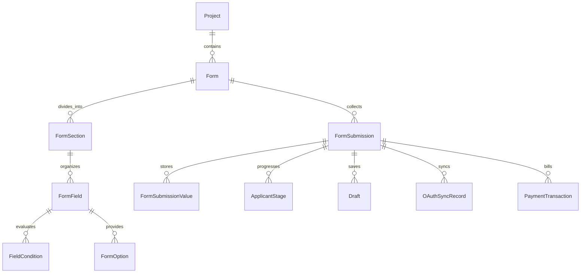
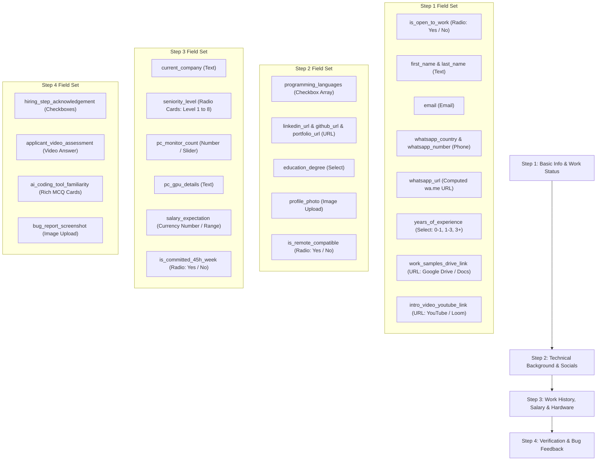

# Forms Specification & Laravel Application Architecture — Data Contracts & Schemas

> **Module:** `02-spec/21-app/21f-forms-spec/`  
> **Version:** `1.0.0`  
> **Status:** `Canonical Specification`  
> **Stack:** Laravel 11.x Eloquent & FormRequest Architecture, Split SQLite DB Engine, JSON Schema Contracts, REST API Envelopes

---

## 1. Scope & Architectural Intent

This specification establishes the authoritative data contracts, schema definitions, validation rules, and REST API interfaces for the **WP Exam & Universal Form Engine**. 

The system implements a decoupled, contract-driven architecture:
1. **Dynamic Form & Field Definitions:** Normalized Eloquent models in `project_<id>.db` defining multi-step wizards, field attributes, nested option groups, and conditional dependency graphs.
2. **Dynamic Conditional Validation Matrix:** Client-side debounced constraints synchronized with authoritative Laravel `FormRequest` classes that dynamically resolve `required` rules based on conditional state.
3. **Draft & Submission Payloads:** Standardized JSON envelopes preserving form progression, multi-step state, applicant attachments, and anti-bot verification tokens.
4. **Universal Response Envelopes:** All REST endpoints strictly return envelope payloads with metadata, timestamps, and error bags adhering to repository standards.

---

## 2. Eloquent Model Architecture & Schema Definitions

All models reside in `App\Models\Forms\` and target the active project SQLite database connection (`project_db`).



### 2.1 Model: `Form`
Represents an isolated form or multi-stage assessment definition within a project database.

| Column | Type | Constraints | Description |
|---|---|---|---|
| `FormId` | `INTEGER` | `PRIMARY KEY AUTOINCREMENT` | Unique identifier |
| `ProjectId` | `INTEGER` | `NOT NULL` | Owning project identifier |
| `Slug` | `TEXT` | `NOT NULL UNIQUE` | URL-safe slug (e.g. `careers-intern-programmer`) |
| `Title` | `TEXT` | `NOT NULL` | Form display title |
| `Description` | `TEXT` | `NULLABLE` | Rich markdown description |
| `ThemeId` | `TEXT` | `NOT NULL DEFAULT 'riseup-asia'` | Active theme token preset |
| `ThemeTokensJson` | `TEXT` | `NULLABLE` | Custom JSON theme overrides |
| `IsActive` | `INTEGER` | `NOT NULL DEFAULT 1` | Positive boolean flag (1 = active) |
| `HasDraftMode` | `INTEGER` | `NOT NULL DEFAULT 1` | Positive boolean flag (1 = draft enabled) |
| `HasCaptcha` | `INTEGER` | `NOT NULL DEFAULT 1` | Positive boolean flag (1 = anti-bot enabled) |
| `CreatedAt` | `TEXT` | `NOT NULL` | ISO-8601 creation timestamp |
| `UpdatedAt` | `TEXT` | `NOT NULL` | ISO-8601 update timestamp |

### 2.2 Model: `FormSection`
Defines a sequential step in the multi-step wizard (e.g. Step 1: Basic Info, Step 2: Technical Background).

| Column | Type | Constraints | Description |
|---|---|---|---|
| `FormSectionId` | `INTEGER` | `PRIMARY KEY AUTOINCREMENT` | Unique identifier |
| `FormId` | `INTEGER` | `NOT NULL REFERENCES Form(FormId)` | Parent form reference |
| `StepOrder` | `INTEGER` | `NOT NULL` | 1-indexed wizard step sequence |
| `Title` | `TEXT` | `NOT NULL` | Step title displayed in stepper ticker |
| `Subtitle` | `TEXT` | `NULLABLE` | Step descriptive sub-header |
| `ConditionJson` | `TEXT` | `NULLABLE` | Dynamic conditional rules governing section visibility |
| `IsVisible` | `INTEGER` | `NOT NULL DEFAULT 1` | Default visibility flag |
| `CreatedAt` | `TEXT` | `NOT NULL` | ISO-8601 creation timestamp |
| `UpdatedAt` | `TEXT` | `NOT NULL` | ISO-8601 update timestamp |

### 2.3 Model: `FormField`
Atomic form input definition supporting multi-media, sliders, ranges, and rich MCQ options.

| Column | Type | Constraints | Description |
|---|---|---|---|
| `FormFieldId` | `INTEGER` | `PRIMARY KEY AUTOINCREMENT` | Unique identifier |
| `FormSectionId` | `INTEGER` | `NOT NULL REFERENCES FormSection(FormSectionId)` | Owning section reference |
| `FieldKey` | `TEXT` | `NOT NULL` | Unique snake_case payload key (e.g. `is_open_to_work`) |
| `FieldType` | `TEXT` | `NOT NULL` | Field category enum: `text`, `email`, `number`, `radio`, `select`, `multiselect`, `mcq_video`, `mcq_image`, `slider`, `fraction_range`, `whatsapp_phone`, `url`, `file_upload`, `textarea` |
| `Label` | `TEXT` | `NOT NULL` | User-facing field label |
| `Placeholder` | `TEXT` | `NULLABLE` | Input placeholder text |
| `HelpText` | `TEXT` | `NULLABLE` | Contextual explanatory text |
| `DefaultValue` | `TEXT` | `NULLABLE` | Default initial value |
| `OrderIndex` | `INTEGER` | `NOT NULL DEFAULT 0` | Display ordering within section |
| `IsRequired` | `INTEGER` | `NOT NULL DEFAULT 0` | Baseline requiredness before dynamic conditions |
| `HasRealtimeValidation` | `INTEGER` | `NOT NULL DEFAULT 1` | Enables debounced 300ms–500ms client check |
| `ValidationRulesJson` | `TEXT` | `NULLABLE` | Serialized validation constraints (regex, min, max) |
| `MediaEmbedJson` | `TEXT` | `NULLABLE` | Video embed URL, audio prompt, or SVG definition |
| `CreatedAt` | `TEXT` | `NOT NULL` | ISO-8601 creation timestamp |
| `UpdatedAt` | `TEXT` | `NOT NULL` | ISO-8601 update timestamp |

### 2.4 Model: `FieldCondition`
Defines reactive dependency rules where a parent field triggers visibility or requirement changes on target fields or sections.

| Column | Type | Constraints | Description |
|---|---|---|---|
| `FieldConditionId` | `INTEGER` | `PRIMARY KEY AUTOINCREMENT` | Unique identifier |
| `ParentFieldKey` | `TEXT` | `NOT NULL` | Source field key triggering condition |
| `Operator` | `TEXT` | `NOT NULL` | Comparison: `equals`, `not_equals`, `contains`, `greater_than`, `in` |
| `ExpectedValue` | `TEXT` | `NOT NULL` | Value to match against |
| `TargetType` | `TEXT` | `NOT NULL` | Target enum: `field`, `section` |
| `TargetKey` | `TEXT` | `NOT NULL` | Target field key or section step order |
| `Action` | `TEXT` | `NOT NULL` | Action enum: `show`, `hide`, `require`, `optional` |
| `IsActive` | `INTEGER` | `NOT NULL DEFAULT 1` | Positive boolean flag |

### 2.5 Model: `FormSubmission`
Immutable audit log and payload container for applicant submissions.

| Column | Type | Constraints | Description |
|---|---|---|---|
| `FormSubmissionId` | `INTEGER` | `PRIMARY KEY AUTOINCREMENT` | Unique identifier |
| `FormId` | `INTEGER` | `NOT NULL REFERENCES Form(FormId)` | Target form |
| `ApplicantEmail` | `TEXT` | `NOT NULL` | Extracted primary applicant email |
| `ApplicantName` | `TEXT` | `NOT NULL` | Consolidated applicant full name |
| `CurrentStage` | `TEXT` | `NOT NULL DEFAULT 'submitted'` | Workflow stage enum: `submitted`, `pre_screen`, `interview`, `accepted`, `rejected` |
| `PayloadJson` | `TEXT` | `NOT NULL` | Complete validated form submission JSON |
| `ScorePercentage` | `REAL` | `NOT NULL DEFAULT 0.0` | Computed assessment score (0.0 to 100.0) |
| `ResumeToken` | `TEXT` | `NULLABLE UNIQUE` | Magic link continuation token |
| `IpHash` | `TEXT` | `NOT NULL` | Salted SHA-256 hash of client IP address |
| `UserAgent` | `TEXT` | `NULLABLE` | Client browser user agent |
| `IsCompleted` | `INTEGER` | `NOT NULL DEFAULT 0` | Positive boolean flag |
| `SubmittedAt` | `TEXT` | `NULLABLE` | ISO-8601 submission timestamp |
| `CreatedAt` | `TEXT` | `NOT NULL` | ISO-8601 creation timestamp |
| `UpdatedAt` | `TEXT` | `NOT NULL` | ISO-8601 update timestamp |

---

## 3. Dynamic Conditional Validation Matrix

### 3.1 Live Form Field Mapping (Developers Organism Reference)

Extracted from live reference form (`https://careers.developers-organism.com/apply/?job=Intern+Programmer`) and screenshot assets:



### 3.2 Dynamic Validation Resolution Rule (Laravel FormRequest)

When evaluating form fields, Laravel dynamically filters rules based on visibility conditions:

```php
<?php

namespace App\Http\Requests\Forms;

use Illuminate\Foundation\Http\FormRequest;
use App\Models\Forms\Form;
use App\Services\Forms\ConditionalEngine;

class SubmitFormRequest extends FormRequest
{
    public function authorize(): bool
    {
        return true;
    }

    public function rules(): array
    {
        $formSlug = $this->route('slug');
        $form = Form::where('Slug', $formSlug)->firstOrFail();
        $payload = $this->all();

        $conditionalEngine = app(ConditionalEngine::class);
        $activeFields = $conditionalEngine->resolveActiveFields($form, $payload);

        $rules = [];
        foreach ($activeFields as $field) {
            $fieldRules = $field->buildValidationRules();
            
            // Dynamic requiredness resolution:
            // Hidden fields are never required; active fields follow dynamic requirements
            if ($conditionalEngine->isRequired($field, $payload)) {
                $fieldRules[] = 'required';
            } else {
                $fieldRules[] = 'nullable';
            }

            $rules[$field->FieldKey] = $fieldRules;
        }

        return $rules;
    }
}
```

---

## 4. JSON Schema Specifications

### 4.1 Form Definition Schema (`form-definition.schema.json`)

```json
{
  "$schema": "https://json-schema.org/draft/2020-12/schema",
  "title": "FormDefinition",
  "type": "object",
  "required": ["slug", "title", "theme_id", "sections"],
  "properties": {
    "slug": { "type": "string", "pattern": "^[a-z0-9-]+$" },
    "title": { "type": "string" },
    "description": { "type": "string" },
    "theme_id": { "type": "string" },
    "has_draft_mode": { "type": "boolean" },
    "has_captcha": { "type": "boolean" },
    "sections": {
      "type": "array",
      "items": {
        "type": "object",
        "required": ["step_order", "title", "fields"],
        "properties": {
          "step_order": { "type": "integer", "minimum": 1 },
          "title": { "type": "string" },
          "subtitle": { "type": "string" },
          "fields": {
            "type": "array",
            "items": {
              "type": "object",
              "required": ["field_key", "field_type", "label"],
              "properties": {
                "field_key": { "type": "string", "pattern": "^[a-z0-9_]+$" },
                "field_type": { 
                  "type": "string",
                  "enum": [
                    "text", "email", "number", "radio", "select", 
                    "multiselect", "mcq_video", "mcq_image", "slider", 
                    "fraction_range", "whatsapp_phone", "url", "file_upload", "textarea"
                  ]
                },
                "label": { "type": "string" },
                "placeholder": { "type": "string" },
                "is_required": { "type": "boolean" },
                "validation": {
                  "type": "object",
                  "properties": {
                    "pattern": { "type": "string" },
                    "min": { "type": "number" },
                    "max": { "type": "number" },
                    "allowed_extensions": { "type": "array", "items": { "type": "string" } }
                  }
                },
                "conditions": {
                  "type": "array",
                  "items": {
                    "type": "object",
                    "required": ["parent_field_key", "operator", "expected_value", "action"],
                    "properties": {
                      "parent_field_key": { "type": "string" },
                      "operator": { "type": "string", "enum": ["equals", "not_equals", "contains", "in"] },
                      "expected_value": { "type": ["string", "number", "boolean", "array"] },
                      "action": { "type": "string", "enum": ["show", "hide", "require", "optional"] }
                    }
                  }
                }
              }
            }
          }
        }
      }
    }
  }
}
```

### 4.2 Draft Mode Payload Schema (`draft-payload.schema.json`)

```json
{
  "$schema": "https://json-schema.org/draft/2020-12/schema",
  "title": "DraftPayload",
  "type": "object",
  "required": ["form_slug", "applicant_email", "current_step", "payload"],
  "properties": {
    "form_slug": { "type": "string" },
    "applicant_email": { "type": "string", "format": "email" },
    "current_step": { "type": "integer", "minimum": 1 },
    "resume_token": { "type": "string" },
    "payload": {
      "type": "object",
      "additionalProperties": true
    },
    "updated_at": { "type": "string", "format": "date-time" }
  }
}
```

---

## 5. REST API Route Contracts

All REST responses adhere to the standard envelope format:
```json
{
  "is_success": true,
  "code": 200,
  "data": {},
  "message": "Operation successful",
  "timestamp": "2026-09-23T10:45:00Z"
}
```

### 5.1 Route Inventory

| Method | Endpoint | Description | Auth Guard |
|---|---|---|---|
| `GET` | `/api/v1/forms/{slug}` | Retrieve complete form definition, sections, and theme tokens | Public |
| `POST` | `/api/v1/forms/{slug}/validate-field` | Real-time debounced single-field validation (300ms–500ms) | Public / Rate-Limited |
| `POST` | `/api/v1/forms/{slug}/test-whatsapp` | Validate and generate WhatsApp URL with ping verification | Public |
| `GET` | `/api/v1/countries/cache` | Static pre-cached country ISO codes, prefixes, and flags | Public / Cached |
| `POST` | `/api/v1/forms/{slug}/draft` | Save partial draft and dispatch resume magic link | Public |
| `GET` | `/api/v1/forms/{slug}/draft/{token}` | Retrieve saved draft for session resumption | Public |
| `POST` | `/api/v1/forms/{slug}/submit` | Authoritative full form submission with anti-bot check | Public / CSRF / Captcha |
| `POST` | `/api/v1/payments/create-intent` | Initialize Stripe Checkout or Wise payment intent | Public / Session |
| `POST` | `/api/v1/payments/webhook/{gateway}` | Gateway webhook listener (Stripe/Wise) | Gateway Signature |
| `GET` | `/api/v1/admin/forms/{id}/submissions` | List candidate submissions with filtering & search | Admin JWT |
| `POST` | `/api/v1/admin/submissions/{id}/stage` | Transition applicant workflow stage and trigger AGM email | Admin JWT |
| `POST` | `/api/v1/admin/submissions/{id}/sync-cloud` | Force trigger Google Drive & Excel sync worker | Admin JWT |

### 5.2 Real-Time Debounced Validation Endpoint Contract

**Request:** `POST /api/v1/forms/{slug}/validate-field`
```json
{
  "field_key": "work_samples_drive_link",
  "value": "https://drive.google.com/drive/folders/1aBcDeFgHiJkLmNoP",
  "form_context": {
    "years_of_experience": "3+",
    "is_open_to_work": "yes"
  }
}
```

**Response (Success):**
```json
{
  "is_success": true,
  "code": 200,
  "data": {
    "is_valid": true,
    "normalized_value": "https://drive.google.com/drive/folders/1aBcDeFgHiJkLmNoP",
    "feedback_message": "Valid Google Drive directory link."
  },
  "message": "Field validation passed",
  "timestamp": "2026-09-23T10:45:12Z"
}
```

**Response (Failure / Validation Error):**
```json
{
  "is_success": false,
  "code": 422,
  "data": {
    "is_valid": false,
    "error_message": "Work samples must be a valid Google Drive, Dropbox, or OneDrive URL."
  },
  "message": "Validation failed",
  "timestamp": "2026-09-23T10:45:15Z"
}
```
