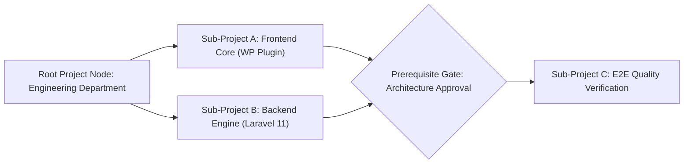
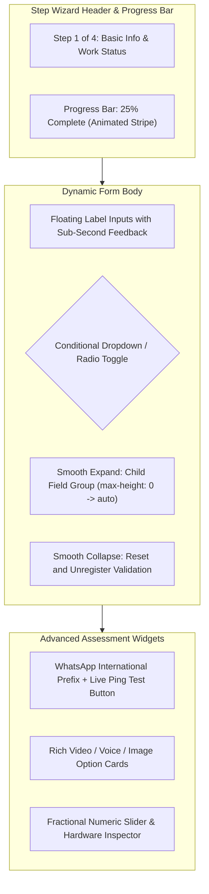

# Forms Specification & Laravel Application Architecture — Visual & UX Guidelines

> **Module:** `02-spec/21-app/21f-forms-spec/`  
> **Version:** `1.0.0`  
> **Status:** `Canonical Specification`  
> **Stack:** React SPA / Vue 3 Component Library, Tailwind CSS Utility System, Less Token Compiler, Framer Motion / CSS Transitions

---

## 1. Visual Design Architecture & Philosophy

The WP Exam & Universal Form Engine UI delivers a consumer-grade, distraction-free experience designed for complex applicant assessments and enterprise project hierarchy orchestration. 

The user experience is split into two primary interfaces:
1. **The Visual Project Node Canvas:** An administrative drag-and-drop node graph canvas where operators visualize projects, recursive sub-projects, prerequisite links, and sequential pipeline flows.
2. **The Dynamic Multi-Step Form Runner:** A responsive, glassmorphic wizard guiding candidates through multi-step assessments with real-time conditional branching, sub-second debounced field feedback, and rich multi-media option cards.

---

## 2. Reference Visual Assets & Screenshots

The design system incorporates and standardizes patterns from real-world career application flows and administrative workflows:

| Asset Name | Repository Path | Visual Design Focus |
|---|---|---|
| Step 1 Reference | `assets/screenshots/form-reference-upload-01.png` | Basic info, country selector, WhatsApp auto-format, work status radio |
| Step 2 Reference | `assets/screenshots/form-reference-upload-02.png` | Language checkboxes, social profiles, portfolio URLs, file attachments |
| Step 3 Reference | `assets/screenshots/form-reference-upload-03.png` | Seniority levels 1-8 radio cards, hardware specs, salary expectations |
| Job Form Classic | `assets/screenshots/job-form.png` | 4-step wizard header, progress ticker, floating input labels |
| Job Form Modern | `assets/screenshots/job-form-v2.png` | High-contrast dark theme, active step badge, focus rings |

---

## 3. Visual Project Node Canvas (Drag & Drop Architecture)

The Administrative Project Tree empowers managers to connect projects and recursive sub-projects visually, defining execution order, prerequisite gates, and completion triggers.



### 3.1 Canvas Component Hierarchy
- **`ProjectCanvas`:** Infinite pan/zoom viewport supporting mouse-wheel zooming (20% to 200%), keyboard navigation, and grid snapping (16px grid).
- **`ProjectNodeCard`:** Rounded 12px card with glassmorphic border, status indicator badge (`draft`, `active`, `archived`), progress ring, and child-count pill.
- **`ConnectionAnchor`:** Interactive magnetic input/output connection handles at node boundaries (top, bottom, left, right).
- **`DependencyEdge`:** Bezier curved connector with animated gradient stroke indicating pipeline progression and conditional gating status.
- **`CycleDetectorModal`:** Real-time visual warning modal intercepting circular connection attempts before state commits.

---

## 4. Dynamic Multi-Step Form Runner UI



### 4.1 Step Wizard Navigation & Progress Tracking
- **Responsive Step Header:** Sticky header containing numbered step badges, step labels, and an SVG checkmark for completed stages.
- **Animated Progress Bar:** Smooth width transition (`transition: width 400ms cubic-bezier(0.4, 0, 0.2, 1)`) showing precise completion percentage.
- **Draft Save Trigger:** Top-right floating button: *"Save & Continue Later"*, opening the email magic-link modal.

### 4.2 Dynamic Branching & Accordion Transitions
When a candidate selects a radio or dropdown option that reveals child questions:
- **Zero Layout Shifts:** Child container expands smoothly from `max-height: 0; opacity: 0; transform: translateY(-8px)` to `max-height: 1000px; opacity: 1; transform: translateY(0)` over `300ms ease-out`.
- **Automatic Scroll Anchor:** If newly revealed fields exceed the viewport, the form runner gently scrolls the first child field into focus.
- **State Preservation:** Previously entered child field values are preserved in local draft cache, but dynamically decoupled from validation rules while hidden.

### 4.3 WhatsApp International Phone & Interactive Ping Test
- **Integrated Country Dial Code Selector:** Reads from pre-cached static country dictionary with ISO-3166-1 flag icons and prefixes (`+1`, `+44`, `+880`, `+91`).
- **Real-Time URL Preview:** Displays the auto-formatted URL in real-time: `https://wa.me/+{country_prefix}{local_number}`.
- **Interactive Ping Test Button:**
  - Candidates can click *"Test WhatsApp Link"* to open a new tab targeting their own phone number.
  - Upon return to the tab, the button transitions to a green verified badge: *"Link Verified"*.

### 4.4 Rich Media Question & Answer Cards
- **Video & Voice Question Prompts:** Embedded 16:9 responsive video player (YouTube, Vimeo, Loom, direct MP4) or custom HTML5 audio visualizer with waveform animation.
- **Interactive MCQ Option Cards:**
  - Option items rendered as clickable cards with custom SVGs or thumbnails.
  - Hover effect: `scale(1.02)` with subtle border highlight.
  - Selected state: High-contrast primary border with checkmark icon badge.

---

## 5. JSON Theme Token Engine

The UI dynamically applies theme tokens via root CSS custom properties. Six presets are built-in, with full override support:

```json
{
  "$schema": "https://json-schema.org/draft/2020-12/schema",
  "theme_id": "riseup-asia",
  "name": "Riseup Asia Modern",
  "tokens": {
    "colors": {
      "bg_primary": "#0f172a",
      "bg_surface": "#1e293b",
      "bg_card": "rgba(30, 41, 59, 0.7)",
      "border_default": "#334155",
      "border_focus": "#38bdf8",
      "text_primary": "#f8fafc",
      "text_secondary": "#94a3b8",
      "text_muted": "#64748b",
      "accent_primary": "#0284c7",
      "accent_hover": "#0369a1",
      "status_success": "#10b981",
      "status_error": "#ef4444",
      "status_warning": "#f59e0b"
    },
    "typography": {
      "font_family_sans": "Inter, system-ui, -apple-system, sans-serif",
      "font_family_mono": "JetBrains Mono, Menlo, monospace",
      "font_size_base": "16px",
      "line_height_base": "1.5"
    },
    "radii": {
      "card": "12px",
      "input": "8px",
      "button": "8px",
      "badge": "9999px"
    },
    "shadows": {
      "card": "0 10px 25px -5px rgba(0, 0, 0, 0.3)",
      "input_focus": "0 0 0 3px rgba(56, 189, 248, 0.25)"
    }
  }
}
```

### 5.1 Preset Catalog

1. **Riseup Asia Modern (`riseup-asia`):** Default enterprise dark slate `#0f172a` with ocean blue accents `#0284c7` and glassmorphic card borders.
2. **Job Forms Clean (`job-forms`):** Pure light mode `#ffffff` background with crisp `#2563eb` interactive focus states matching the live careers reference form.
3. **VS Code Dark (`vscode-dark`):** Editor-inspired `#1e1e1e` background, `#252526` surface cards, and `#007acc` blue status rings.
4. **Dracula High Contrast (`dracula`):** Signature `#282a36` background, `#44475a` borders, `#bd93f9` purple highlights, and `#50fa7b` success accents.
5. **Microsoft Blue (`ms-blue`):** Neutral corporate `#f3f4f6` background with iconic `#0078d4` primary buttons and accessible high-contrast text.
6. **Cyber Neon (`cyber-neon`):** Deep black `#050505` with neon green `#22c55e` and cyan `#06b6d4` glowing borders for specialized tech screening.
