# Forms Specification & Laravel Application Architecture — Verification Gates & Test Matrix

> **Module:** `02-spec/21-app/21f-forms-spec/`  
> **Version:** `1.0.0`  
> **Status:** `Canonical Specification`  
> **Stack:** PHPUnit Test Suites, Playwright E2E Integration Runner, Python Automation Scripts, SQLite WAL Integrity Audits

---

## 1. Scope & Verification Strategy

This document establishes the mandatory quality gates, test contracts, and acceptance criteria governing the **WP Exam & Universal Form Engine** across its standalone Laravel 11 implementation and subsequent WordPress plugin distribution.

All automated test suites must pass without exemptions. CI/CD checks may never be disabled, bypassed, or commented out.

---

## 2. Automated Quality Gates Matrix

```mermaid
flowchart TD
    G1["VG-FRM-001: Debounced Client Validation Gate (300-500ms)"]
    G2["VG-FRM-002: Dynamic Conditional Server Validation Gate"]
    G3["VG-FRM-003: WhatsApp URL Builder & Ping Test Gate"]
    G4["VG-FRM-004: Static Country Cache & IP Fallback Gate"]
    G5["VG-FRM-005: Draft Save & Magic-Link Resume Gate"]
    G6["VG-FRM-006: Anti-Bot & Turnstile/reCAPTCHA Gate"]
    G7["VG-FRM-007: Visual Node Tree Cycle Detection Gate"]
    G8["VG-FRM-008: Split SQLite Isolation & WAL Mode Gate"]
    G9["VG-FRM-009: Applicant Pipeline & AGM Email Dispatch Gate"]
    G10["VG-FRM-010: Coding Guidelines & Boolean Conformance Gate"]

    G1 --> PassReport["Quality Certification Pass"]
    G2 --> PassReport
    G3 --> PassReport
    G4 --> PassReport
    G5 --> PassReport
    G6 --> PassReport
    G7 --> PassReport
    G8 --> PassReport
    G9 --> PassReport
    G10 --> PassReport
```

---

## 3. Verification Gate Specifications

### 3.1 VG-FRM-001: Debounced Client Validation Gate
- **Intent:** Prevent excessive server load by ensuring real-time field validation is throttled via a 300ms–500ms debounce window.
- **Given:** A candidate types rapidly into an input field (e.g. typing 20 characters in 400ms).
- **When:** The input event listener processes keystrokes.
- **Then:** Exactly one HTTP POST request to `/api/v1/forms/{slug}/validate-field` is dispatched 350ms after the final keystroke. Zero intermediate requests are fired during active typing.
- **Test Suite:** Playwright Browser Network Interceptor (`tests/e2e/forms/debounce.spec.ts`).

### 3.2 VG-FRM-002: Dynamic Conditional Server Validation Gate
- **Intent:** Validate that Laravel dynamically ignores required constraints on hidden fields while strictly enforcing them on visible fields.
- **Given:** A form with conditional field `pc_gpu_details` which only appears if `seniority_level` is greater than 3.
- **Scenario A (Hidden):** `seniority_level = 2` and `pc_gpu_details` is null.
  - **Result:** Validation passes with HTTP 200; `pc_gpu_details` is omitted from the required rules array.
- **Scenario B (Shown):** `seniority_level = 5` and `pc_gpu_details` is null.
  - **Result:** Validation fails with HTTP 422 Unprocessable Entity; error bag contains `pc_gpu_details: "This field is required."`.
- **Test Suite:** PHPUnit Feature Test (`tests/Feature/Forms/DynamicConditionalValidationTest.php`).

### 3.3 VG-FRM-003: WhatsApp URL Builder & Ping Test Gate
- **Intent:** Ensure international numbers format cleanly into valid WhatsApp deep links with interactive verification.
- **Given:** Selected country code `+880` (Bangladesh) and local subscriber number `1712345678`.
- **When:** Format pipeline executes.
- **Then:** Generated URL strictly matches `https://wa.me/+8801712345678` with zero spaces, hyphens, or parenthetical characters.
- **And:** Clicking "Test WhatsApp Link" generates a sanitized URL and toggles the verified state upon window blur/focus cycle.
- **Test Suite:** Pest Unit Test (`tests/Unit/Forms/WhatsAppFormatterTest.php`).

### 3.4 VG-FRM-004: Static Country Cache & IP Fallback Gate
- **Intent:** Eliminate remote API dependencies for country lists and provide immediate offline-capable dial prefixes.
- **Given:** Application boots or requests country static data.
- **When:** Client invokes `GET /api/v1/countries/cache`.
- **Then:** Pre-compiled static JSON dataset is returned in under 20ms with 240+ ISO-3166-1 entries, calling codes, and SVG flag assets.
- **And:** If client IP header is present (`CF-Connecting-IP` or `X-Forwarded-For`), the system accurately pre-selects the country dropdown.
- **Test Suite:** PHPUnit Feature Test (`tests/Feature/Forms/CountryCacheTest.php`).

### 3.5 VG-FRM-005: Draft Save & Magic-Link Resume Gate
- **Intent:** Allow candidates to safely exit multi-step forms and resume from any device without data loss.
- **Given:** Candidate completes Steps 1 and 2, then clicks "Save & Continue Later" with email `applicant@example.com`.
- **When:** `POST /api/v1/forms/{slug}/draft` is executed.
- **Then:** A secure cryptographic token is generated and stored in `project_<id>.db` inside the `Draft` table.
- **And:** An email containing resume link `/apply/resume/{token}` is dispatched.
- **And:** Accessing `/apply/resume/{token}` restores all previously answered fields and mounts the wizard at Step 3.
- **Test Suite:** Playwright E2E Integration Suite (`tests/e2e/forms/draft_resume.spec.ts`).

### 3.6 VG-FRM-006: Anti-Bot & Turnstile/reCAPTCHA Gate
- **Intent:** Protect submission endpoints from automated spam and AI crawler abuse.
- **Given:** A form with `has_captcha = 1`.
- **When:** An automated POST submission arrives with an invalid or expired captcha token.
- **Then:** Laravel rejects the request with HTTP 403 Forbidden and error code `BOT_VERIFICATION_FAILED`.
- **And:** Valid tokens with score >= 0.7 are approved for database persistence.
- **Test Suite:** PHPUnit Security Test (`tests/Feature/Forms/AntiBotSecurityTest.php`).

### 3.7 VG-FRM-007: Visual Node Tree Cycle Detection Gate
- **Intent:** Prevent infinite loops and circular dependencies in the administrative project hierarchy canvas.
- **Given:** Project Node A connects to Node B, and Node B connects to Node C.
- **When:** Operator drags an edge from Node C back to Node A.
- **Then:** The Canvas Graph Engine detects a directed cycle via Tarjan's algorithm.
- **And:** The connection is rejected immediately on the client with a visual warning toast, preventing corrupted state persistence to `root.db`.
- **Test Suite:** Vitest Canvas Engine Suite (`resources/js/tests/canvas/cycle_detector.test.ts`).

### 3.8 VG-FRM-008: Split SQLite Isolation & WAL Mode Gate
- **Intent:** Guarantee that each project's data remains isolated in its dedicated SQLite database file without cross-project leakage.
- **Given:** Two distinct projects with IDs 101 and 102.
- **When:** Submissions are persisted for each project.
- **Then:** Data for Project 101 is written strictly to `database/projects/project_101.db` and Project 102 to `database/projects/project_102.db`.
- **And:** Every database file executes `PRAGMA journal_mode = WAL;` and `PRAGMA foreign_keys = ON;`.
- **Test Suite:** PHPUnit Database Architecture Test (`tests/Feature/Database/SplitDbIsolationTest.php`).

### 3.9 VG-FRM-009: Applicant Pipeline & AGM Email Dispatch Gate
- **Intent:** Ensure stage transitions trigger Markdown email templates with accurate variable interpolation.
- **Given:** An applicant transitions from `submitted` to `interview`.
- **When:** Admin clicks "Schedule Interview" in the review console.
- **Then:** Markdown template is rendered substituting `${applicant_name}`, `${job_title}`, and `${interview_link}`.
- **And:** Dispatch log is recorded in `logs.db` with status `sent`.
- **Test Suite:** PHPUnit Mail Integration Test (`tests/Feature/Forms/EmailDispatchTest.php`).

### 3.10 VG-FRM-010: Coding Guidelines & Boolean Conformance Gate
- **Intent:** Enforce repository-wide AI coding rules across all backend and frontend assets.
- **Rules Verified:**
  - Zero explicit `true` boolean evaluations (e.g. `=== true` is strictly prohibited).
  - Positive boolean naming only (`is_active`, `has_draft_mode`; negative booleans like `is_uncompleted` banned).
  - No mixed-polarity conditions in the same logical statement.
  - Strict lowercase file naming across all created modules.
  - Strict relative Git paths with zero absolute paths or `file:///` URIs.
- **Test Suite:** Python Repository Linter (`03-ai-scripts/06-cicd-local-runner.py`).
