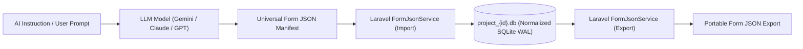

# Forms Specification & Laravel Application Architecture — LLM Instruction Studio & JSON Architecture

> **Module:** `02-spec/21-app/21f-forms-spec/`  
> **File:** `05-llm-instruction-set.md`  
> **Version:** `1.0.0`  
> **Status:** `Canonical Specification`  
> **Target:** Autonomous AI Agents, LLM Code Generators, Form Exporters/Importers

---

## 1. Intent & LLM Instruction Manual

This document serves as the **drop-in instruction set for Large Language Models (LLMs)**. Any AI agent or developer can load this markdown specification into its system prompt or context to generate, manipulate, import, or export valid WP Exam & Universal Form Engine form structures without ambiguity.



---

## 2. Universal Form JSON Specification

When generating or exporting forms, the payload MUST strictly conform to the following schema structure:

```json
{
  "$schema": "https://json-schema.org/draft/2020-12/schema",
  "version": "1.0.0",
  "form": {
    "slug": "intern-programmer-application",
    "title": "Intern Programmer Application",
    "description": "4-Step dynamic career application with conditional branching, debounced validation, and WhatsApp verification.",
    "theme_id": "riseup-asia",
    "is_active": true,
    "has_draft_mode": true,
    "has_captcha": true,
    "sections": [
      {
        "step_order": 1,
        "title": "Basic Info & Work Status",
        "subtitle": "Tell us about yourself and your availability",
        "is_visible": true,
        "fields": [
          {
            "field_key": "is_open_to_work",
            "field_type": "radio",
            "label": "Are you currently open to work?",
            "placeholder": null,
            "default_value": "yes",
            "is_required": true,
            "has_realtime_validation": true,
            "options": [
              { "option_key": "yes", "label": "Yes, immediately", "score_weight": 1.0 },
              { "option_key": "no", "label": "No, just browsing", "score_weight": 0.0 }
            ],
            "conditions": []
          },
          {
            "field_key": "first_name",
            "field_type": "text",
            "label": "First Name",
            "placeholder": "e.g. John",
            "default_value": null,
            "is_required": true,
            "has_realtime_validation": true,
            "conditions": []
          },
          {
            "field_key": "last_name",
            "field_type": "text",
            "label": "Last Name",
            "placeholder": "e.g. Doe",
            "default_value": null,
            "is_required": true,
            "has_realtime_validation": true,
            "conditions": []
          },
          {
            "field_key": "email",
            "field_type": "email",
            "label": "Email Address",
            "placeholder": "name@example.com",
            "default_value": null,
            "is_required": true,
            "has_realtime_validation": true,
            "conditions": []
          },
          {
            "field_key": "whatsapp_number",
            "field_type": "whatsapp_phone",
            "label": "WhatsApp Phone Number",
            "placeholder": "+880 1712-345678",
            "default_value": null,
            "is_required": true,
            "has_realtime_validation": true,
            "conditions": []
          },
          {
            "field_key": "years_of_experience",
            "field_type": "select",
            "label": "Years of Experience",
            "placeholder": "Select experience bracket",
            "default_value": "0-1",
            "is_required": false,
            "has_realtime_validation": true,
            "options": [
              { "option_key": "0-1", "label": "0 - 1 years", "score_weight": 1.0 },
              { "option_key": "1-3", "label": "1 - 3 years", "score_weight": 2.0 },
              { "option_key": "3+", "label": "3+ years", "score_weight": 3.0 }
            ],
            "conditions": [
              {
                "parent_field_key": "is_open_to_work",
                "operator": "equals",
                "expected_value": "yes",
                "target_type": "field",
                "action": "show"
              },
              {
                "parent_field_key": "is_open_to_work",
                "operator": "equals",
                "expected_value": "yes",
                "target_type": "field",
                "action": "require"
              }
            ]
          },
          {
            "field_key": "work_samples_drive_link",
            "field_type": "url",
            "label": "Work Samples (Google Drive / Dropbox URL)",
            "placeholder": "https://drive.google.com/...",
            "default_value": null,
            "is_required": true,
            "has_realtime_validation": true,
            "conditions": []
          }
        ]
      },
      {
        "step_order": 2,
        "title": "Technical Background & Socials",
        "subtitle": "Your GitHub, portfolio, and programming knowledge",
        "is_visible": true,
        "fields": [
          {
            "field_key": "github_url",
            "field_type": "url",
            "label": "GitHub Profile URL",
            "placeholder": "https://github.com/username",
            "default_value": null,
            "is_required": true,
            "has_realtime_validation": true,
            "conditions": []
          },
          {
            "field_key": "portfolio_url",
            "field_type": "url",
            "label": "Portfolio or Personal Website",
            "placeholder": "https://example.com",
            "default_value": null,
            "is_required": false,
            "has_realtime_validation": true,
            "conditions": []
          }
        ]
      }
    ]
  }
}
```

---

## 3. Directives for AI Agents & Form Builders

When instructed to create, extend, or modify a form:

1. **Step Ordering:** Every wizard section must have a unique sequential `step_order` starting at 1.
2. **Field Keys:** All `field_key` attributes must use strictly lowercase `snake_case` (e.g. `is_open_to_work`, `years_of_experience`).
3. **Boolean Principles:** Never generate negative boolean flags (e.g. use `is_active: true`, never `is_disabled: false`).
4. **Reactive Conditions:** Conditions must declare:
   - `parent_field_key`: The trigger field key.
   - `operator`: One of `equals`, `not_equals`, `greater_than`, `in`.
   - `expected_value`: Matching literal or array.
   - `action`: `show`, `hide`, `require`, or `optional`.
5. **Database Normalization:** When the Laravel engine imports this JSON, it writes:
   - 1 record to `Form`
   - N records to `FormSection`
   - N records to `FormField`
   - N records to `FieldCondition`
   - N records to `FormOption`
   This guarantees normalized queries, sub-millisecond lookups, and minimal SQLite database file sizes.
