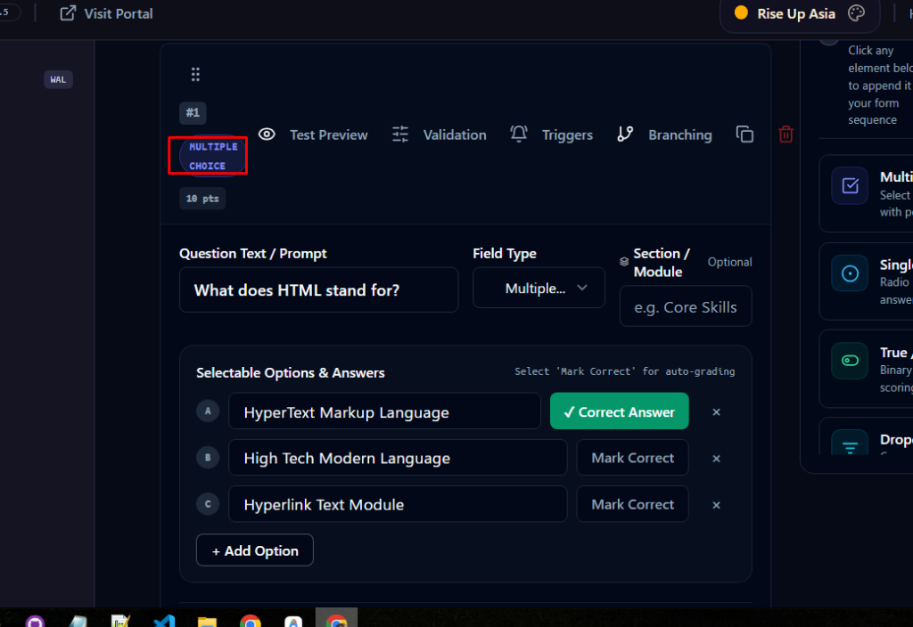

# Specification: Form Design Validation & Health Audit System

## 1. User Request (Verbatim)

```text
is it done?

please add design validation system??

https://prnt.sc/e53IZKChkVu4

Fix these buttons. Do not add too many buttons. Try to compact the buttons with a drop-down. And the idea here is that we can preview it and make sure the buttons does have the proper alignment everywhere, and try to integrate a code to import Google Forms. Okay, so if we have the Google Form account access authentication, we should be able to import a whole Google Form to our system. That is a priority. Okay, and on top of this, we can actually customize the logic. So please make a big plan and implement this and try to fix this UI/UX and make sure the UI is fluid. Currently, if we go into the right-hand side also, it looks terrible. It looks like a junior or someone who does not have any design conscious, they have done it. So please based on this
```

Visual Reference: 

---

## 2. Executive Summary & Blast Radius

This specification defines the **Form Design Validation & Health Audit System** (`DesignValidationSystem`):
1. **Core Problem:** When building complex assessments, forms, or imported Google Forms, authors frequently introduce UX flaws: missing prompt labels, multiple choice questions with < 2 options, unreachable DAG branching targets, missing correct answer keys in graded quizzes, invalid regex patterns, or accessibility contrast violations.
2. **Design Validation Architecture:**
   - Real-time diagnostic engine evaluating 8 distinct design and UX quality dimensions:
     - `MISSING_PROMPT`: Blank or generic placeholder question labels.
     - `INSUFFICIENT_CHOICES`: Single/multiple choice questions with less than 2 distinct non-empty choices.
     - `UNSET_CORRECT_ANSWER`: Graded quiz questions lacking designated correct answer keys.
     - `UNREACHABLE_BRANCH_TARGET`: Conditional DAG branching rules pointing to non-existent field IDs.
     - `INVALID_REGEX_SYNTAX`: Regex validation rules with invalid patterns.
     - `ACCESSIBILITY_PLACEHOLDER`: Text inputs without descriptive placeholder guidance.
     - `COGNITIVE_OVERLOAD`: Form sections exceeding 10 consecutive complex fields without a section break.
     - `CONTRAST_COMPLIANCE`: WCAG AA/AAA theme contrast rating.
3. **User Experience:**
   - Real-time **Design Health Pill** in the FormBuilder top bar (`Health: 95% • 2 Tips`) with glowing status colors (emerald for 90+, amber for 70-89, rose for <70).
   - Dedicated **Design Health Inspector Drawer** with categorized issues and **1-Click Auto-Fix** buttons.
   - Inline card diagnostics badge in `sortable-field-card.tsx` alerting authors to specific field issues.

---

## 3. Extracted Actionable Task List

- **Task-01:** Design Validation Engine (`src/lib/design-validation-engine.ts`) with severity scores and auto-fix mutations.
- **Task-02:** Design Health Inspector Panel (`src/components/forms/design-validation-panel.tsx`) with category tabs and 1-click fixes.
- **Task-03:** Inline Field Card Diagnostic Badges in `src/components/forms/sortable-field-card.tsx`.
- **Task-04:** FormBuilder Top Bar & Inspector Dock Integration in `src/components/forms/FormBuilder.tsx`.
- **Task-05:** Automated Unit Tests & Quality Verification in `src/test/design-validation.test.ts`.
