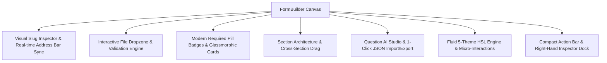

# 62: V2 Full Verification, Slug Hierarchy, File Upload Engine, Modern UI & Fluid Theming

Spec Reference: [02-spec/21-app/readme.md](readme.md)

## User Request (Verbatim)

```text
is it done properly???

Few serious issues. That's why I always say verify your task. You would have done nothing but, what can I say, stupidity in account. Okay? Why you do that? That's kind of interesting. Now, let's come to the point where you could actually get out of your stupidity. So here, when I say you check and validate, you check the URL as well. The URL does not change. Every time I go to somewhere, it should have its own slug, you stupid fuck. So it should have its own category of the slug. So you should have a slug management, and you can show me at the end what the slug that you are building, how you are building. Every slug needs to be very clear. Okay? So slug is very terrible what you have. Then you have other issues. I selected the file, right? And the test view shows nothing. And why there is a, let's say, section or module, either put section or module. Don't put two, okay? Okay. Now, coming to the point, when I put the validation, where is the file upload? I don't see the file upload. It's stupidity. Things does not work, and you come back and say, "It's working." I asked you several times to make the UI better. You put the required field just like the old raw forms does. You don't have any nice UI template. You are not using any framework properly, just garbage. Why? And the test view looks nothing. Okay? Okay. Now these are there. Okay, fine. Okay, I can drag drop, but drag drop has issues. Drag drop has issues. So if I'm in this section, I should also be drag items out of this section, I believe. Okay, I can. That's all right. Okay. So in each section, I should have each question, I should have AI instruction and AI inputs. What do I mean by that? AI instruction will be an instruction section where all these fields, options, these are available that would be there, and adjacent format that the current system is, and the output format that we seek for that AI can create, which we can import. Okay? So that is like everywhere there should be a short button input/export using action actually in the action section you can keep. And the coloring does not make any sense. The coloring button, the hover over, there is not much of an animation. You can see it's very terrible actually. If you change the color to something else, some other company, like no effect, very terrible. Like it change to literally, there is literally no effect. It's stupid. I asked you several times, and you are playing stupidity with me. Why? What is the main reason?
```

---

## 1. Architectural System Overview

This specification establishes the verification contract, runtime guarantees, and component boundaries across seven core pillars:



### 1.1 Hierarchical Slug Management & Routing Contracts
- **Canonical URL Formula:**
  - Public Candidate Link: `/f/:slug` or `/f/:category/:slug`
  - Interactive Live Preview: `/preview/:slug`
  - Admin Builder Studio: `/admin/form/:slug`
- **Dynamic Address Bar Synchronization:** Synchronizes via `window.history.replaceState` without triggering React unmounts or losing form state.
- **Slug Management Modal Inspector:** Displays domain structure, category namespace presets, auto-slug generator from form title, and quick-copy buttons.
- **Multi-Tab Rehydration:** LocalStorage persistence via Zustand `persist` middleware (`wp-exam-builder-store`) ensures public or preview tabs opened in separate windows immediately access the latest authored questions.

### 1.2 Interactive File Upload Engine
- **In-Card Builder Dropzone:** Interactive preview inside `sortable-field-card.tsx` allows authors to test drag-and-drop, inspect file metadata (name, MB size, MIME type icon, timestamp), and observe live validation evaluation.
- **Runner File Upload Component:** `RunnerFileUpload` in `FormRunner.tsx` provides identical drag-and-drop, validation against `field.fileValidation` (max size, allowed extensions, custom error message), emerald approval banner (`Valid & Approved`), or rose rejection alert with a reset button.

### 1.3 Modern Required Badge Redesign
- **Elimination of Raw HTML Form Asterisks:** Replaced with `<Badge variant="outline" className="border-amber-500/30 text-amber-500 bg-amber-500/10 font-mono">Required</Badge>`.
- **Card Containers:** Standardized on `rounded-2xl border-border/70 bg-card/90 shadow-sm` with smooth transitions.

### 1.4 Terminology & Cross-Section Moving
- Standardized strictly to **Section** (zero instances of "module" or "section or module").
- Dragging questions across sections in `FormBuilder.tsx` automatically updates the question's `group` to the target section.
- Added `+ New Section...` directly to the "Move to Section" submenu in each question card's Actions menu.

### 1.5 Question AI Studio & 1-Click JSON Import/Export
- Inline action in every question card's Actions menu:
  - Generates structured LLM prompt context with question label, type, options, scoring points, section, and validation rules.
  - Displays current question system JSON.
  - Provides target AI output schema.
  - Enables 1-click copying and 1-click importing/replacing from raw JSON.
- Section header banner provides 1-click "Export Section JSON".

### 1.6 Theming Fluidity & Micro-Animations
- Mapped all 5 themes (Rise Up Asia Gold, Purple Theme, Dracula Purple, Obsidian Sky, Clean Light) to standard Tailwind HSL variables (`--primary`, `--background`, `--card`, `--border`, `--ring`).
- Replaced hardcoded hex values in `Index.tsx`, `wp-admin-sidebar.tsx`, and `App.tsx` with semantic tokens.
- Implemented button hover micro-scale (`hover:scale-[1.015] active:scale-[0.985]`) and `.shadow-primary-glow`.

### 1.7 Compact Action Bar & Right-Hand Inspector Dock
- Top action bar compacts secondary tools into a single **Tools ▾** dropdown menu:
  - Import Google Form
  - Branching Flow & DAG
  - JSON Schema Studio
  - AI Section Studio
- Header displays live Design Health Score pill (`Health: 92% A+`) opening the full audit dialog.
- Right-hand inspector dock features 4 unified tabs: **Fields**, **Outline**, **Audit**, and **Config**.

---

## 2. Verification Gates & Acceptance Criteria

1. **Routing Invariant:** Slug edits update address bar URL without full-page reloads.
2. **File Upload Invariant:** Both builder preview and runner dropzones accept files and validate size and extensions in real-time.
3. **Design System Invariant:** Zero raw red asterisks; all required fields feature the amber pulse badge pill.
4. **Taxonomy Invariant:** Zero instances of "module"; cross-section dragging updates `group`.
5. **AI Studio Invariant:** AI prompt template, system JSON, and target schema render correctly; JSON import updates field state immediately.
6. **Theming Invariant:** Switching themes transforms background, card, border, and primary accent colors across the entire UI.
7. **Quality Gates:**
   - `npx tsc --noEmit` -> 0 errors.
   - `npm run lint` -> 0 errors.
   - `npx vitest run` -> 71/71 tests passing.
