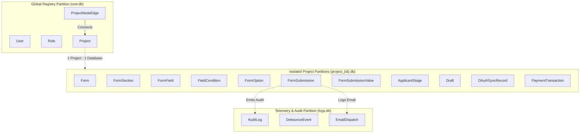
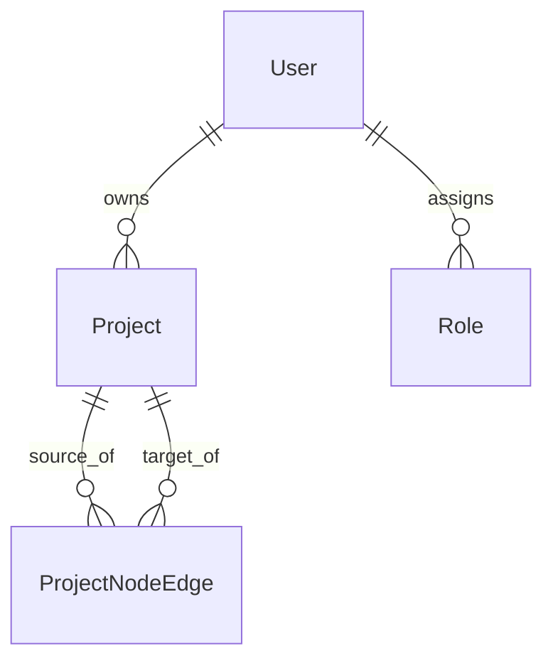
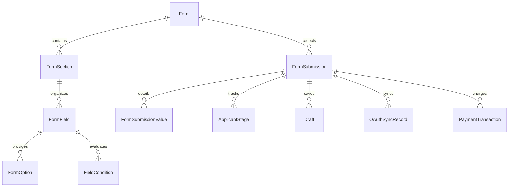

# Split SQLite Database Schema — Forms, Submissions & Project Tree Architecture

> **Module:** `02-spec/23-app-db/`  
> **File:** `02-forms-and-project-tree-schema.md`  
> **Version:** `1.0.0`  
> **Status:** `Canonical Specification`  
> **Stack:** Split SQLite 3 Multi-Database Architecture, WAL Mode, Foreign Key Enforcement, PascalCase Tables

---

## 1. Split SQLite Architecture Overview

To provide maximum isolation, ultra-fast query performance, and effortless backup/export capabilities, the WP Exam & Universal Form Engine divides persistence into three distinct SQLite partitions:



---

## 2. Partition 1: `root.db` (Global Registry & Node Tree)

The `root.db` SQLite database persists global administrative entities, project registrations, and the directed acyclic graph (DAG) defining project node tree connections.

### 2.1 Entity Relationship Diagram (`root.db`)



### 2.2 DDL Specifications (`root.db`)

```sql
PRAGMA journal_mode = WAL;
PRAGMA foreign_keys = ON;

-- 1. Global Users
CREATE TABLE IF NOT EXISTS User (
    UserId INTEGER PRIMARY KEY AUTOINCREMENT,
    Email TEXT NOT NULL UNIQUE,
    PasswordHash TEXT NOT NULL,
    FullName TEXT NOT NULL,
    Role TEXT NOT NULL DEFAULT 'manager',
    IsActive INTEGER NOT NULL DEFAULT 1,
    CreatedAt TEXT NOT NULL DEFAULT (datetime('now')),
    UpdatedAt TEXT NOT NULL DEFAULT (datetime('now'))
);

CREATE INDEX IF NOT EXISTS idx_user_email ON User(Email);

-- 2. Projects Registry
CREATE TABLE IF NOT EXISTS Project (
    ProjectId INTEGER PRIMARY KEY AUTOINCREMENT,
    OwnerUserId INTEGER NOT NULL REFERENCES User(UserId) ON DELETE RESTRICT,
    Slug TEXT NOT NULL UNIQUE,
    Title TEXT NOT NULL,
    Description TEXT,
    DatabasePath TEXT NOT NULL,
    IsActive INTEGER NOT NULL DEFAULT 1,
    CreatedAt TEXT NOT NULL DEFAULT (datetime('now')),
    UpdatedAt TEXT NOT NULL DEFAULT (datetime('now'))
);

CREATE INDEX IF NOT EXISTS idx_project_slug ON Project(Slug);

-- 3. Project Node Canvas Edges (Directed Hierarchy & Prerequisites)
CREATE TABLE IF NOT EXISTS ProjectNodeEdge (
    ProjectNodeEdgeId INTEGER PRIMARY KEY AUTOINCREMENT,
    SourceProjectId INTEGER NOT NULL REFERENCES Project(ProjectId) ON DELETE CASCADE,
    TargetProjectId INTEGER NOT NULL REFERENCES Project(ProjectId) ON DELETE CASCADE,
    EdgeType TEXT NOT NULL DEFAULT 'prerequisite', -- 'prerequisite', 'subproject', 'sequential'
    CanvasPositionX REAL NOT NULL DEFAULT 0.0,
    CanvasPositionY REAL NOT NULL DEFAULT 0.0,
    IsActive INTEGER NOT NULL DEFAULT 1,
    CreatedAt TEXT NOT NULL DEFAULT (datetime('now')),
    CONSTRAINT uq_project_edge UNIQUE (SourceProjectId, TargetProjectId)
);

CREATE INDEX IF NOT EXISTS idx_project_edge_source ON ProjectNodeEdge(SourceProjectId);
CREATE INDEX IF NOT EXISTS idx_project_edge_target ON ProjectNodeEdge(TargetProjectId);
```

---

## 3. Partition 2: `project_<id>.db` (Isolated Project Schema)

Every project maintains its own isolated database file (e.g. `database/projects/project_101.db`). This file contains the complete form schemas, questions, dynamic branching rules, applicant submissions, and payment records.

### 3.1 Entity Relationship Diagram (`project_<id>.db`)



### 3.2 DDL Specifications (`project_<id>.db`)

```sql
PRAGMA journal_mode = WAL;
PRAGMA foreign_keys = ON;

-- 1. Forms
CREATE TABLE IF NOT EXISTS Form (
    FormId INTEGER PRIMARY KEY AUTOINCREMENT,
    ProjectId INTEGER NOT NULL,
    Slug TEXT NOT NULL UNIQUE,
    Title TEXT NOT NULL,
    Description TEXT,
    ThemeId TEXT NOT NULL DEFAULT 'riseup-asia',
    ThemeTokensJson TEXT,
    IsActive INTEGER NOT NULL DEFAULT 1,
    HasDraftMode INTEGER NOT NULL DEFAULT 1,
    HasCaptcha INTEGER NOT NULL DEFAULT 1,
    CreatedAt TEXT NOT NULL DEFAULT (datetime('now')),
    UpdatedAt TEXT NOT NULL DEFAULT (datetime('now'))
);

CREATE INDEX IF NOT EXISTS idx_form_slug ON Form(Slug);

-- 2. Form Wizard Sections
CREATE TABLE IF NOT EXISTS FormSection (
    FormSectionId INTEGER PRIMARY KEY AUTOINCREMENT,
    FormId INTEGER NOT NULL REFERENCES Form(FormId) ON DELETE CASCADE,
    StepOrder INTEGER NOT NULL,
    Title TEXT NOT NULL,
    Subtitle TEXT,
    ConditionJson TEXT,
    IsVisible INTEGER NOT NULL DEFAULT 1,
    CreatedAt TEXT NOT NULL DEFAULT (datetime('now')),
    UpdatedAt TEXT NOT NULL DEFAULT (datetime('now')),
    CONSTRAINT uq_form_step UNIQUE (FormId, StepOrder)
);

CREATE INDEX IF NOT EXISTS idx_form_section_order ON FormSection(FormId, StepOrder);

-- 3. Form Fields
CREATE TABLE IF NOT EXISTS FormField (
    FormFieldId INTEGER PRIMARY KEY AUTOINCREMENT,
    FormSectionId INTEGER NOT NULL REFERENCES FormSection(FormSectionId) ON DELETE CASCADE,
    FieldKey TEXT NOT NULL,
    FieldType TEXT NOT NULL,
    Label TEXT NOT NULL,
    Placeholder TEXT,
    HelpText TEXT,
    DefaultValue TEXT,
    OrderIndex INTEGER NOT NULL DEFAULT 0,
    IsRequired INTEGER NOT NULL DEFAULT 0,
    HasRealtimeValidation INTEGER NOT NULL DEFAULT 1,
    ValidationRulesJson TEXT,
    MediaEmbedJson TEXT,
    CreatedAt TEXT NOT NULL DEFAULT (datetime('now')),
    UpdatedAt TEXT NOT NULL DEFAULT (datetime('now')),
    CONSTRAINT uq_section_field_key UNIQUE (FormSectionId, FieldKey)
);

CREATE INDEX IF NOT EXISTS idx_field_section ON FormField(FormSectionId, OrderIndex);

-- 4. Field Option Cards (For Radios, Selects & Rich MCQs)
CREATE TABLE IF NOT EXISTS FormOption (
    FormOptionId INTEGER PRIMARY KEY AUTOINCREMENT,
    FormFieldId INTEGER NOT NULL REFERENCES FormField(FormFieldId) ON DELETE CASCADE,
    OptionKey TEXT NOT NULL,
    Label TEXT NOT NULL,
    ThumbnailUrl TEXT,
    MediaEmbedUrl TEXT,
    ScoreWeight REAL NOT NULL DEFAULT 0.0,
    OrderIndex INTEGER NOT NULL DEFAULT 0,
    IsActive INTEGER NOT NULL DEFAULT 1,
    CreatedAt TEXT NOT NULL DEFAULT (datetime('now'))
);

CREATE INDEX IF NOT EXISTS idx_option_field ON FormOption(FormFieldId, OrderIndex);

-- 5. Reactive Dynamic Field Conditions
CREATE TABLE IF NOT EXISTS FieldCondition (
    FieldConditionId INTEGER PRIMARY KEY AUTOINCREMENT,
    ParentFieldKey TEXT NOT NULL,
    Operator TEXT NOT NULL, -- 'equals', 'not_equals', 'contains', 'in'
    ExpectedValue TEXT NOT NULL,
    TargetType TEXT NOT NULL, -- 'field', 'section'
    TargetKey TEXT NOT NULL,
    Action TEXT NOT NULL, -- 'show', 'hide', 'require', 'optional'
    IsActive INTEGER NOT NULL DEFAULT 1,
    CreatedAt TEXT NOT NULL DEFAULT (datetime('now'))
);

CREATE INDEX IF NOT EXISTS idx_condition_parent ON FieldCondition(ParentFieldKey);

-- 6. Form Submissions
CREATE TABLE IF NOT EXISTS FormSubmission (
    FormSubmissionId INTEGER PRIMARY KEY AUTOINCREMENT,
    FormId INTEGER NOT NULL REFERENCES Form(FormId) ON DELETE RESTRICT,
    ApplicantEmail TEXT NOT NULL,
    ApplicantName TEXT NOT NULL,
    CurrentStage TEXT NOT NULL DEFAULT 'submitted',
    PayloadJson TEXT NOT NULL,
    ScorePercentage REAL NOT NULL DEFAULT 0.0,
    ResumeToken TEXT UNIQUE,
    IpHash TEXT NOT NULL,
    UserAgent TEXT,
    IsCompleted INTEGER NOT NULL DEFAULT 0,
    SubmittedAt TEXT,
    CreatedAt TEXT NOT NULL DEFAULT (datetime('now')),
    UpdatedAt TEXT NOT NULL DEFAULT (datetime('now'))
);

CREATE INDEX IF NOT EXISTS idx_submission_form ON FormSubmission(FormId, CreatedAt);
CREATE INDEX IF NOT EXISTS idx_submission_email ON FormSubmission(ApplicantEmail);
CREATE INDEX IF NOT EXISTS idx_submission_token ON FormSubmission(ResumeToken);

-- 7. Normalized Submission Values (For Ultra-Fast Search & Filtering)
CREATE TABLE IF NOT EXISTS FormSubmissionValue (
    FormSubmissionValueId INTEGER PRIMARY KEY AUTOINCREMENT,
    FormSubmissionId INTEGER NOT NULL REFERENCES FormSubmission(FormSubmissionId) ON DELETE CASCADE,
    FieldKey TEXT NOT NULL,
    ValueText TEXT,
    CreatedAt TEXT NOT NULL DEFAULT (datetime('now'))
);

CREATE INDEX IF NOT EXISTS idx_sub_value_lookup ON FormSubmissionValue(FieldKey, ValueText);

-- 8. Applicant Stage Progression
CREATE TABLE IF NOT EXISTS ApplicantStage (
    ApplicantStageId INTEGER PRIMARY KEY AUTOINCREMENT,
    FormSubmissionId INTEGER NOT NULL REFERENCES FormSubmission(FormSubmissionId) ON DELETE CASCADE,
    StageName TEXT NOT NULL,
    ReviewStatus TEXT NOT NULL DEFAULT 'pending', -- 'pending', 'approved', 'rejected'
    Score REAL NOT NULL DEFAULT 0.0,
    FeedbackNotes TEXT,
    ReviewerUserId INTEGER,
    TransitionedAt TEXT NOT NULL DEFAULT (datetime('now'))
);

CREATE INDEX IF NOT EXISTS idx_applicant_stage ON ApplicantStage(FormSubmissionId, StageName);

-- 9. Form Drafts (Magic Link Persistence)
CREATE TABLE IF NOT EXISTS Draft (
    DraftId INTEGER PRIMARY KEY AUTOINCREMENT,
    FormId INTEGER NOT NULL REFERENCES Form(FormId) ON DELETE CASCADE,
    ApplicantEmail TEXT NOT NULL,
    ResumeToken TEXT NOT NULL UNIQUE,
    CurrentStep INTEGER NOT NULL DEFAULT 1,
    PayloadJson TEXT NOT NULL,
    ExpiresAt TEXT NOT NULL,
    CreatedAt TEXT NOT NULL DEFAULT (datetime('now')),
    UpdatedAt TEXT NOT NULL DEFAULT (datetime('now'))
);

CREATE INDEX IF NOT EXISTS idx_draft_token ON Draft(ResumeToken);

-- 10. External Cloud Sync Records (Google Drive & Excel)
CREATE TABLE IF NOT EXISTS OAuthSyncRecord (
    OAuthSyncRecordId INTEGER PRIMARY KEY AUTOINCREMENT,
    FormSubmissionId INTEGER NOT NULL REFERENCES FormSubmission(FormSubmissionId) ON DELETE CASCADE,
    Provider TEXT NOT NULL, -- 'google_drive', 'microsoft_excel'
    RemoteResourceId TEXT,
    SyncStatus TEXT NOT NULL DEFAULT 'pending', -- 'pending', 'synced', 'failed'
    ErrorMessage TEXT,
    SyncedAt TEXT,
    CreatedAt TEXT NOT NULL DEFAULT (datetime('now'))
);

CREATE INDEX IF NOT EXISTS idx_sync_status ON OAuthSyncRecord(Provider, SyncStatus);

-- 11. Payment Transactions (Stripe & Wise)
CREATE TABLE IF NOT EXISTS PaymentTransaction (
    PaymentTransactionId INTEGER PRIMARY KEY AUTOINCREMENT,
    FormSubmissionId INTEGER NOT NULL REFERENCES FormSubmission(FormSubmissionId) ON DELETE CASCADE,
    Gateway TEXT NOT NULL, -- 'stripe', 'wise'
    TransactionRef TEXT NOT NULL UNIQUE,
    Amount REAL NOT NULL,
    Currency TEXT NOT NULL DEFAULT 'USD',
    Status TEXT NOT NULL DEFAULT 'pending', -- 'pending', 'completed', 'failed', 'refunded'
    PayloadJson TEXT,
    CreatedAt TEXT NOT NULL DEFAULT (datetime('now')),
    UpdatedAt TEXT NOT NULL DEFAULT (datetime('now'))
);

CREATE INDEX IF NOT EXISTS idx_payment_ref ON PaymentTransaction(TransactionRef);
```

---

## 4. Partition 3: `logs.db` (Telemetry & Audit)

The global `logs.db` file receives asynchronous telemetry, live debounce metrics, and AGM email notifications across all project activities.

### 4.1 DDL Specifications (`logs.db`)

```sql
PRAGMA journal_mode = WAL;

-- 1. General Audit Logs
CREATE TABLE IF NOT EXISTS AuditLog (
    AuditLogId INTEGER PRIMARY KEY AUTOINCREMENT,
    ProjectId INTEGER,
    FormId INTEGER,
    UserId INTEGER,
    Action TEXT NOT NULL,
    EntityName TEXT NOT NULL,
    EntityId INTEGER,
    ChangesJson TEXT,
    IpHash TEXT,
    CreatedAt TEXT NOT NULL DEFAULT (datetime('now'))
);

CREATE INDEX IF NOT EXISTS idx_audit_project ON AuditLog(ProjectId, CreatedAt);

-- 2. Debounce Validation Telemetry
CREATE TABLE IF NOT EXISTS DebounceEvent (
    DebounceEventId INTEGER PRIMARY KEY AUTOINCREMENT,
    FormId INTEGER NOT NULL,
    FieldKey TEXT NOT NULL,
    DurationMs INTEGER NOT NULL,
    IsValid INTEGER NOT NULL,
    IpHash TEXT NOT NULL,
    CreatedAt TEXT NOT NULL DEFAULT (datetime('now'))
);

CREATE INDEX IF NOT EXISTS idx_debounce_form ON DebounceEvent(FormId, CreatedAt);

-- 3. Email Dispatch Logs
CREATE TABLE IF NOT EXISTS EmailDispatch (
    EmailDispatchId INTEGER PRIMARY KEY AUTOINCREMENT,
    FormSubmissionId INTEGER NOT NULL,
    TemplateSlug TEXT NOT NULL,
    RecipientEmail TEXT NOT NULL,
    Status TEXT NOT NULL DEFAULT 'sent', -- 'queued', 'sent', 'failed'
    InterpolatedVarsJson TEXT,
    DispatchedAt TEXT NOT NULL DEFAULT (datetime('now'))
);

CREATE INDEX IF NOT EXISTS idx_email_recipient ON EmailDispatch(RecipientEmail);
```
