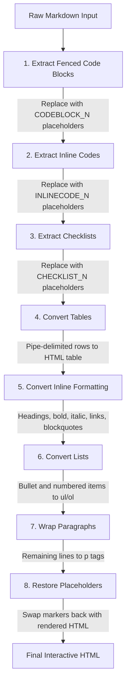
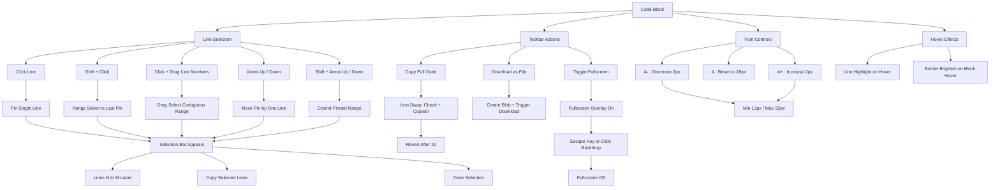
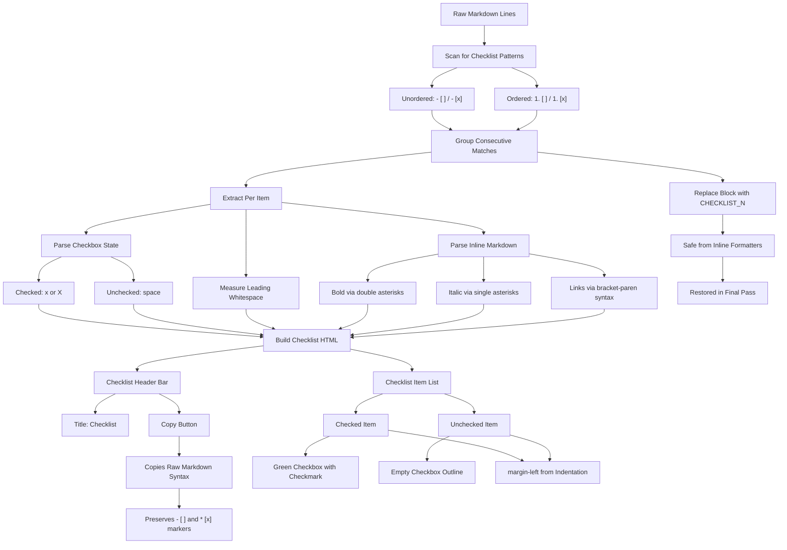
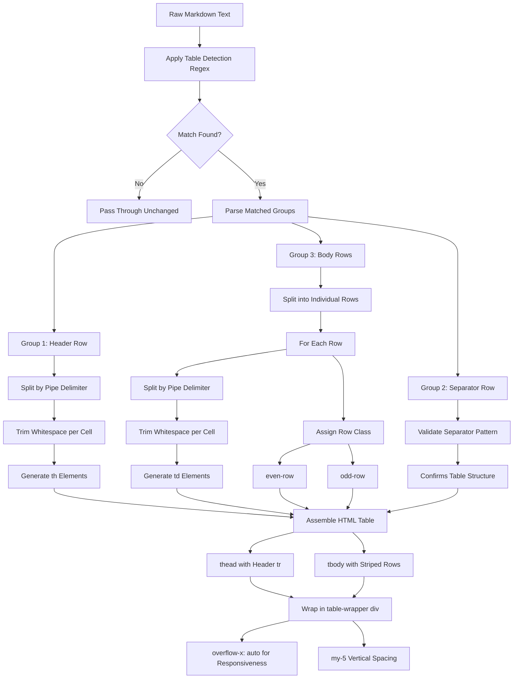
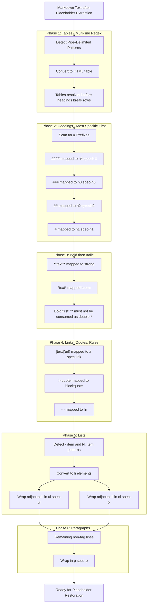

# Markdown Rendering — UX & Visual Design Specification

**Version:** 1.0.0  
**Updated:** 2026-04-03  
**AI Confidence:** High  
**Ambiguity:** None

---

## Keywords

`markdown`, `code-blocks`, `syntax-highlighting`, `checklists`, `typography`, `interactions`

---

## Purpose

Defines the user-facing visual design, interaction patterns, and typography system for the bespoke markdown rendering pipeline used throughout the application. Covers code blocks, checklists, tables, inline formatting, and all interactive behaviors.

---

## 1. Rendering Pipeline Overview

The markdown renderer uses a **placeholder-based extraction pipeline** to safely transform raw markdown into interactive HTML. The processing order is critical — each stage protects its output from being mangled by subsequent stages.

| Step | Description | Output |
|------|-------------|--------|
| 1. Fenced code blocks | Extract `` ```…``` `` → placeholder | Interactive code block HTML |
| 2. Inline code | Extract `` `code` `` → placeholder | `<code class="inline-code">` |
| 3. Checklists | Extract `- [x]` / `- [ ]` → placeholder | Interactive checklist with copy button |
| 4. Tables | Convert `|col|` patterns → `<table>` | Striped table with wrapper |
| 5. Inline formatting | Headings, bold, italic, links, blockquotes | Semantic HTML with CSS classes |
| 6. Lists | `- item` → `<ul>`, `1. item` → `<ol>` | Styled list elements |
| 7. Paragraphs | Wrap remaining lines → `<p>` | `<p class="spec-p">` |
| 8. Restore placeholders | Swap markers back with rendered HTML | Final output |

### Pipeline Flow Diagram



---

## 2. Code Block Visual Design

### 2.1 Structure

Each code block consists of three visual zones:

| Zone | Content |
|------|---------|
| **Header** | Language badge (colored dot + label), line count, font controls, copy/download/fullscreen buttons |
| **Body** | Line numbers (left gutter) + syntax-highlighted code (scrollable) |
| **Selection bar** | Appears at bottom when lines are pinned — shows range label, copy selected, clear (✕) |

### 2.2 Language Badge Colors

Every recognized language displays a colored dot and label in the header. Colors use HSL values:

| Language | Aliases | Badge Color (HSL) | File Extension |
|----------|---------|-------------------|----------------|
| TypeScript | `ts`, `tsx`, `typescript` | `99 83% 62%` | `.ts` / `.tsx` |
| JavaScript | `js`, `javascript` | `53 93% 54%` | `.js` |
| Go | `go`, `golang` | `194 66% 55%` | `.go` |
| PHP | `php` | `234 45% 60%` | `.php` |
| CSS | `css` | `264 55% 58%` | `.css` |
| JSON | `json` | `38 92% 50%` | `.json` |
| Bash/Shell | `bash`, `sh`, `shell` | `120 40% 55%` | `.sh` |
| SQL | `sql` | `200 70% 55%` | `.sql` |
| Rust | `rust` | `25 85% 55%` | `.rs` |
| HTML/XML | `html`, `xml` | `12 80% 55%` | `.html` / `.xml` |
| YAML | `yaml`, `yml` | `0 75% 55%` | `.yaml` / `.yml` |
| Markdown | `md`, `markdown` | `252 85% 60%` | `.md` |
| Tree/Structure | `tree` | `252 85% 60%` | `.txt` |
| Plain Text | (no lang / `text`) | `220 10% 50%` | `.txt` |

### 2.3 Syntax Highlighting

- **Library:** highlight.js (core bundle, not full 180+ languages)
- **Theme:** `github-dark.css`
- **Strategy:** Tagged language → `hljs.highlight()`. No tag → `hljs.highlightAuto()`. Auto-detect plaintext + tree markers → custom tree highlighter

### 2.4 Tree Structure Auto-Detection

Code blocks are auto-classified as tree/structure when they contain:

- Box-drawing characters: `├ └ │ ─`
- Lines ending in `/` (directory pattern)
- Lines matching `word.ext` (file pattern)

Visual treatment for tree content:

| Element | Visual Treatment |
|---------|-----------------|
| Directories | `📁` prefix, `tree-dir` class |
| Files | `📄` prefix, `tree-file` class |
| Box-drawing chars | `tree-guide` spans (dimmed opacity) |
| `#` comments | `tree-comment` spans (green, italic) |
| `...` ellipsis | `tree-ellipsis` spans |

---

## 3. Code Block Interactions

### Interaction Model Diagram



### 3.1 Line Selection

| Interaction | Behavior |
|-------------|----------|
| Click line number or code line | **Pin** single line (yellow highlight, `line-pinned` class) |
| Shift + Click | **Range select** from last pinned line to clicked line |
| Click + Drag across line numbers | **Drag select** a contiguous range |
| Arrow Up/Down (when pinned) | Move pinned selection by one line |
| Shift + Arrow Up/Down | Extend the pinned range |

**Pinned line visual state:**

| Property | Value |
|----------|-------|
| Background | `rgba(234, 179, 8, 0.15)` (yellow tint) |
| Class | `line-pinned` |

**Hover line visual state:**

| Property | Value |
|----------|-------|
| Background | `rgba(255, 255, 255, 0.03)` (subtle white tint) |
| Class | `line-highlight` |

### 3.2 Selection Bar

When lines are pinned, a floating bar appears at the bottom of the code block:

| Element | Behavior |
|---------|----------|
| Range label | "Lines N–M" (or "Line N" for single) |
| Header label | Mirrors the range in the code block header |
| Copy selected | Copies only pinned lines' text to clipboard |
| ✕ button | Clears entire selection |

### 3.3 Copy Button

- Stores full escaped code in `data-code` attribute
- Click: copies decoded text to clipboard
- Feedback animation: copy icon → check icon + "Copied!" → reverts after 2 seconds
- `copied` CSS class toggled during feedback

### 3.4 Download Button

- Creates a `Blob` from decoded code
- Triggers download as `code.{ext}` (extension from language mapping)

### 3.5 Font Size Controls

| Button | Action | Limits |
|--------|--------|--------|
| `A-` | Decrease by 2px | Min: 12px |
| `A+` | Increase by 2px | Max: 32px |
| `A` | Reset to default | 18px |

CSS custom properties used:

```css
--code-font-size: 18px;      /* Adjustable per block */
--code-line-height: 1.6;     /* Consistent line height */
```

Line number height is synchronized:

```css
height: calc(var(--code-font-size) * var(--code-line-height));
font-size: calc(var(--code-font-size) * 0.7);
```

### 3.6 Fullscreen Mode

| Aspect | Specification |
|--------|---------------|
| Trigger | Fullscreen button on each code block |
| Class | `code-fullscreen` on wrapper |
| Backdrop | `code-fullscreen-overlay` div (click to dismiss) |
| Dismiss | Escape key or click backdrop |
| Sizing | Fixed position, z-index 100, 95vw × 90vh, centered |

---

## 4. Checklist Design

### Detection & Rendering Flow Diagram



### 4.1 Detection

Lines matching:

- `^\s*[-*+]\s*\[([ xX])\]\s*(.+)$` (unordered)
- `^\s*\d+\.\s*\[([ xX])\]\s*(.+)$` (ordered)

Consecutive matching lines are grouped into a single checklist block.

### 4.2 Visual Structure

| Element | Description |
|---------|-------------|
| Header bar | "Checklist" title label + "Copy" button |
| Checked items | Green checkbox with ✓, `checked` class |
| Unchecked items | Empty checkbox outline |
| Indentation | Preserved via `margin-left` computed from leading whitespace |
| Inline formatting | Bold, italic, links rendered within checklist items |

### 4.3 Copy Behavior

- Copies **raw markdown** syntax (`- [ ]`, `* [x]`) — not HTML
- Preserves original list markers and indentation

---

## 5. Table Rendering

### Detection & Rendering Flow Diagram



### 5.1 Detection

Regex pattern: `^(\|.+\|)\n(\|[-| :]+\|)\n((?:\|.+\|\n?)*)`

### 5.2 Visual Treatment

| Feature | Implementation |
|---------|----------------|
| Wrapper | `<div class="table-wrapper my-5">` with `overflow-x: auto` |
| Header | `<thead>` row with bold styling |
| Row striping | Alternating `even-row` / `odd-row` classes |
| Responsiveness | Horizontal scroll on overflow |

---

## 6. Typography System

### 6.1 Font Stack

| Element | Font | Weight | Fallback |
|---------|------|--------|----------|
| H1–H2 headings | Ubuntu | 700 | sans-serif |
| H3–H4 headings | Ubuntu | 600 | sans-serif |
| Body text | Poppins | 400 | sans-serif |
| Code blocks | System monospace | 400 | Courier New |
| Sidebar / Navigation | Poppins | 400, 500 | sans-serif |

### 6.2 Font Loading

Google Fonts `<link>` with `font-display: swap`:

- **Ubuntu:** 400, 500, 600, 700
- **Poppins:** 300, 400, 500, 600

### 6.3 Heading Styles

| Heading | Visual Treatment |
|---------|-----------------|
| H1 | Gradient text (purple → pink), large size, bold, hover color shift |
| H2 | Gradient text, medium-large size, bold, hover color shift |
| H3 | Solid color, smaller, semi-bold |
| H4 | Solid color, smaller, semi-bold |

---

## 7. Inline Formatting Map

| Markdown Syntax | HTML Element | CSS Class |
|-----------------|-------------|-----------|
| `# Heading` | `<h1>` | `spec-h1` |
| `## Heading` | `<h2>` | `spec-h2` |
| `### Heading` | `<h3>` | `spec-h3` |
| `#### Heading` | `<h4>` | `spec-h4` |
| `**bold**` | `<strong>` | — |
| `*italic*` | `<em>` | — |
| `[text](url)` | `<a>` | `spec-link` |
| `> quote` | `<blockquote>` | `spec-blockquote` |
| `---` | `<hr>` | — |
| `` `code` `` | `<code>` | `inline-code` |
| `- item` | `<li>` → `<ul>` | `spec-li` / `spec-ul` |
| `1. item` | `<li>` → `<ol>` | `spec-oli` / `spec-ol` |
| Bare text | `<p>` | `spec-p` |

### Conversion Order (Critical)

1. Tables (multi-line regex, before headings break the pattern)
2. Headings (`####` → `###` → `##` → `#`, most-specific first)
3. Bold → Italic (bold first so `**` isn't consumed as double italic)
4. Links, blockquotes, horizontal rules
5. Lists (`- item` → `<li>`, then wrap adjacent `<li>` in `<ul>`/`<ol>`)
6. Paragraphs (wrap remaining non-tag lines)

### Inline Formatting Flow Diagram



---

## 8. CSS Architecture

### 8.1 Namespace

All styles live under the `.prose-spec` namespace in `index.css`.

### 8.2 Color System

| Context | Value |
|---------|-------|
| Theme | Dark by default |
| Code block background | `rgba(0, 0, 0, 0.4)` with subtle borders |
| Pinned lines | `rgba(234, 179, 8, 0.15)` (yellow tint) |
| Hover lines | `rgba(255, 255, 255, 0.03)` (white tint) |
| Custom properties | `--lang-accent`, `--badge-color`, `--code-font-size` |

### 8.3 Responsive Behavior

| Element | Strategy |
|---------|----------|
| Code blocks | Horizontal scroll on overflow |
| Tables | Wrapped in `table-wrapper` with `overflow-x: auto` |
| Fullscreen | Viewport-relative sizing (95vw × 90vh) |

---

## 9. React Integration Pattern

### 9.1 Component Architecture

```
MarkdownRenderer (React component)
  ├── renderMarkdown(content) → HTML string (memoized via useMemo)
  ├── dangerouslySetInnerHTML rendering
  ├── useCodeBlockEvents hook (event delegation)
  └── Fullscreen overlay state management
```

### 9.2 Event Delegation Strategy

All code block interactions use **event delegation** on the container element — not individual listeners per button/line. This is required because code blocks are rendered as raw HTML strings via `dangerouslySetInnerHTML`, making React refs unavailable.

The `useCodeBlockEvents` hook attaches 14 event listeners to the container (plus document-level listeners for mousemove/mouseup/keydown) and cleans them up on re-render.

---

## 10. Escape & Decode Utilities

HTML entities used for storing code in `data-code` attributes:

| Character | Entity |
|-----------|--------|
| `&` | `&amp;` |
| `<` | `&lt;` |
| `>` | `&gt;` |
| `'` | `&#39;` |
| `"` | `&quot;` |
| `\n` | `&#10;` |

The `decodeEscaped()` function reverses this for clipboard and download operations.

---

## 11. Key Design Decisions

| # | Decision | Rationale |
|---|----------|-----------|
| 1 | No markdown library | Full control over output structure and interactivity |
| 2 | Placeholder extraction | Prevents code/checklist content from being mangled by inline formatters |
| 3 | HTML string rendering | Code blocks too complex for JSX; raw HTML + event delegation is simpler |
| 4 | highlight.js core only | Register only needed languages (not the 180+ full bundle) |
| 5 | CSS custom properties | Per-block font size adjustment without JS style manipulation |
| 6 | Tree auto-detection | Heuristic-based, no special language tag required (but `tree` tag also works) |
| 7 | Synchronized line numbers | Line number height from same CSS variables as code lines — perfect alignment at any font size |

---

## Cross-References

| Reference | Location |
|-----------|----------|
| Parent Overview | `./00-overview.md` |
| Accessibility Standards | `./02-accessibility-standards-ux.md` |
| Keyboard Shortcuts | `./04-keyboard-shortcuts-ux.md` |
| Performance Optimization | `./03-performance-optimization-ux.md` |
| Spec File Viewer Design | `../../41-time-log-ui/02-frontend/06-spec-file-viewer-design.md` |
